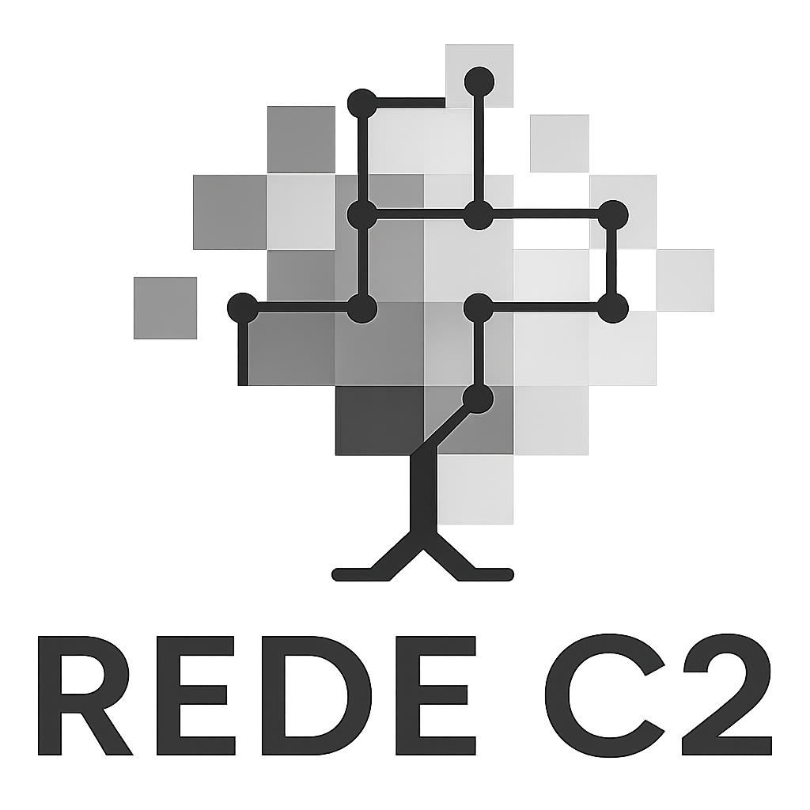

```{=html}
<link rel="preconnect" href="https://fonts.googleapis.com">
<link rel="preconnect" href="https://fonts.gstatic.com" crossorigin>
<link href="https://fonts.googleapis.com/css2?family=Playfair+Display:ital,wght@0,700;0,900;1,700&family=Lora:ital,wght@0,400;0,500;1,400&family=Space+Mono:wght@400;700&display=swap" rel="stylesheet">
```

```{=html}
<style>
  /* ── RESET título Quarto (title vazio mas pode gerar espaço) ── */
  .quarto-title-block,
  #title-block-header {
    display: none !important;
  }

  /* ── FUNDO FIXO ── */
  body {
    background-image: url("/figures/c2_bg.jpg");
    background-repeat: no-repeat;
    background-size: cover;
    background-attachment: fixed;
    background-position: center top;
    font-family: 'Lora', Georgia, serif;
  }

  main.content {
    background: transparent;
    padding-top: 0;
    padding-bottom: 3rem;
  }

  /* ══════════════════════════════════════
     HERO CARD — substitui carousel + título
  ══════════════════════════════════════ */
  .hero-card {
    width: 100%;
    padding: 3.5rem 2.5rem 3rem 2.5rem;
    background: rgba(250, 246, 238, 0.97);
    border-bottom: 4px solid #C85A3A;
    box-shadow: 0 14px 40px rgba(0,0,0,0.18);
    position: relative;
    z-index: 2;
    margin-bottom: 0;
    overflow: hidden;
  }

  /* faixa decorativa verde no topo */
  .hero-card::before {
    content: '';
    position: absolute;
    top: 0; left: 0; right: 0;
    height: 5px;
    background: linear-gradient(90deg, #5C7A3E 0%, #C85A3A 60%, #7A5A18 100%);
  }

  /* marca d'água sutil no canto */
  .hero-card::after {
    content: 'C2';
    position: absolute;
    right: 2.5rem;
    bottom: -0.5rem;
    font-family: 'Playfair Display', serif;
    font-size: 9rem;
    font-weight: 900;
    color: rgba(200,90,58,0.05);
    line-height: 1;
    pointer-events: none;
    user-select: none;
  }

  .hero-inner {
    max-width: 1100px;
    margin: 0 auto;
    display: grid;
    grid-template-columns: 1fr auto;
    gap: 2rem;
    align-items: center;
  }

  .hero-text-col {}

  .hero-logo-col {
    display: flex;
    flex-direction: column;
    align-items: center;
    gap: 1rem;
  }

  .hero-logo-col img {
    width: 130px;
    display: block;
    filter: drop-shadow(0 4px 12px rgba(0,0,0,0.12));
  }

  /* linha separadora vertical */
  .hero-divider {
    width: 1px;
    height: 100%;
    background: linear-gradient(to bottom, transparent, #DDD0B3 30%, #DDD0B3 70%, transparent);
    margin: 0 0.5rem;
    align-self: stretch;
  }

  .hero-eyebrow {
    font-family: 'Space Mono', monospace;
    font-size: 0.68rem;
    font-weight: 700;
    letter-spacing: 0.14em;
    text-transform: uppercase;
    color: #5C7A3E;
    margin-bottom: 0.6rem;
    display: flex;
    align-items: center;
    gap: 0.5rem;
  }
  .hero-eyebrow::before {
    content: '';
    display: inline-block;
    width: 28px;
    height: 2px;
    background: #5C7A3E;
    border-radius: 2px;
  }

  .hero-title {
    font-family: 'Playfair Display', serif;
    font-size: clamp(2.6rem, 5.5vw, 4rem);
    font-weight: 900;
    color: #C85A3A;
    line-height: 1.05;
    margin: 0 0 0.6rem 0;
    letter-spacing: -0.01em;
  }

  .hero-subtitle {
    font-family: 'Lora', serif;
    font-style: italic;
    font-size: clamp(1rem, 1.8vw, 1.2rem);
    color: #4A3A22;
    opacity: 0.9;
    margin: 0 0 1.6rem 0;
    line-height: 1.5;
  }

  .hero-lead {
    font-family: 'Lora', serif;
    font-size: clamp(0.95rem, 1.5vw, 1.07rem);
    color: #3A2C16;
    line-height: 1.85;
    margin: 0 0 1.6rem 0;
    padding-left: 1.1rem;
    border-left: 3px solid #5C7A3E;
  }

  /* BADGES bioma */
  .biome-badges {
    display: flex;
    gap: 0.7rem;
    flex-wrap: wrap;
    margin-bottom: 0;
  }
  .badge {
    display: inline-flex;
    align-items: center;
    gap: 0.4rem;
    padding: 0.32rem 0.85rem 0.32rem 0.65rem;
    border-radius: 100px;
    font-family: 'Space Mono', monospace;
    font-size: 0.7rem;
    font-weight: 700;
    letter-spacing: 0.07em;
    text-transform: uppercase;
  }
  .badge-caatinga {
    background: rgba(200,90,58,0.1);
    color: #C85A3A;
    border: 1.5px solid rgba(200,90,58,0.32);
  }
  .badge-cerrado {
    background: rgba(92,122,62,0.1);
    color: #4A7030;
    border: 1.5px solid rgba(92,122,62,0.32);
  }
  .badge-network {
    background: rgba(139,105,20,0.1);
    color: #7A5A18;
    border: 1.5px solid rgba(139,105,20,0.3);
  }

  /* stat pills no hero */
  .hero-stats {
    display: flex;
    gap: 1.2rem;
    flex-wrap: wrap;
    margin-top: 1.5rem;
    padding-top: 1.4rem;
    border-top: 1px dashed #DDD0B3;
  }
  .hero-stat {
    display: flex;
    flex-direction: column;
    gap: 0.15rem;
  }
  .hero-stat-value {
    font-family: 'Playfair Display', serif;
    font-size: 1.7rem;
    font-weight: 900;
    color: #C85A3A;
    line-height: 1;
  }
  .hero-stat-label {
    font-family: 'Space Mono', monospace;
    font-size: 0.65rem;
    font-weight: 700;
    letter-spacing: 0.09em;
    text-transform: uppercase;
    color: #7A5A18;
  }
  .hero-stat-sep {
    width: 1px;
    background: #DDD0B3;
    align-self: stretch;
    margin: 0 0.2rem;
  }

  /* ── CARTÕES ── */
  .content-card {
    width: 100%;
    margin: 0;
    padding: 2rem 2.25rem;
    background: rgba(250, 246, 238, 0.96);
    border-radius: 18px;
    box-shadow: 0 12px 30px rgba(0,0,0,0.18);
    backdrop-filter: blur(6px);
    -webkit-backdrop-filter: blur(6px);
    position: relative;
    z-index: 2;
    border-top: 3px solid #C85A3A;
  }
  .content-card .inner {
    max-width: 1100px;
    margin: 0 auto;
  }
  .content-card h2 {
    font-family: 'Playfair Display', serif;
    color: #C85A3A;
    font-size: clamp(1.4rem, 2.8vw, 1.9rem);
    font-weight: 700;
    margin-top: 0;
    margin-bottom: 1.1rem;
    padding-bottom: 0.45rem;
    border-bottom: 1px solid #DDD0B3;
    display: flex;
    align-items: center;
    gap: 0.55rem;
  }
  .content-card p {
    font-family: 'Lora', serif;
    font-size: clamp(0.96rem, 1.6vw, 1.07rem);
    line-height: 1.85;
    color: #4A3A22;
  }
  .content-card ul {
    padding-left: 0;
    list-style: none;
  }
  .content-card ul li {
    font-family: 'Lora', serif;
    font-size: clamp(0.96rem, 1.6vw, 1.07rem);
    line-height: 1.8;
    color: #4A3A22;
    padding: 0.3rem 0 0.3rem 1.8rem;
    position: relative;
  }
  .content-card ul li::before {
    content: '';
    position: absolute;
    left: 0;
    top: 50%;
    transform: translateY(-50%);
    width: 16px;
    height: 16px;
    background-image: url("data:image/svg+xml,%3Csvg xmlns='http://www.w3.org/2000/svg' viewBox='0 0 24 24' fill='none'%3E%3Cpath d='M5 12h11M12 7l5 5-5 5' stroke='%23C85A3A' stroke-width='2.2' stroke-linecap='round' stroke-linejoin='round'/%3E%3C/svg%3E");
    background-repeat: no-repeat;
    background-size: contain;
  }
  .content-card h3 {
    font-family: 'Space Mono', monospace;
    color: #7A5A18;
    font-size: 0.8rem;
    font-weight: 700;
    letter-spacing: 0.08em;
    text-transform: uppercase;
    margin-bottom: 0.7rem;
    margin-top: 0;
    display: flex;
    align-items: center;
    gap: 0.45rem;
  }

  /* DESTAQUE goal */
  .goal-box {
    margin-top: 1.3rem;
    padding: 0.9rem 1.3rem;
    background: linear-gradient(90deg, rgba(92,122,62,0.08) 0%, rgba(200,90,58,0.05) 100%);
    border-radius: 10px;
    border-left: 3px solid #5C7A3E;
  }
  .goal-box .goal-label {
    font-family: 'Space Mono', monospace;
    font-size: 0.7rem;
    font-weight: 700;
    text-transform: uppercase;
    letter-spacing: 0.1em;
    color: #5C7A3E;
    display: block;
    margin-bottom: 0.4rem;
  }
  .goal-box p {
    margin: 0;
    font-style: italic;
    font-size: 0.98rem;
    color: #2A1F10;
  }

  /* GRID 2 colunas */
  .sites-grid {
    display: grid;
    grid-template-columns: 1fr 1fr;
    gap: 1.3rem;
    margin-top: 0.5rem;
  }
  .sites-box {
    background: rgba(221,208,179,0.25);
    border-radius: 12px;
    padding: 1.2rem 1.4rem;
    border: 1px solid #DDD0B3;
  }

  /* CONTACT */
  .contact-row {
    display: flex;
    align-items: center;
    gap: 0.65rem;
    padding: 0.5rem 0;
    border-bottom: 1px dashed #DDD0B3;
    font-family: 'Lora', serif;
    font-size: 1rem;
    color: #5A4A30;
  }
  .contact-row:last-child { border-bottom: none; }
  .contact-row svg { flex-shrink: 0; }

  /* JANELA entre cartões */
  .bg-window {
    width: 100%;
    height: 5.5rem;
  }
  .bg-window-sm {
    width: 100%;
    height: 2.5rem;
  }

  /* Institutions grid */
  .inst-grid {
    display: grid;
    grid-template-columns: repeat(5, minmax(0, 1fr));
    gap: 1.1rem;
    margin-top: 0.7rem;
  }
  .inst-item {
    background: rgba(255,255,255,0.90);
    border: 1px solid rgba(221,208,179,0.85);
    border-radius: 14px;
    padding: 0.95rem 0.9rem 0.85rem 0.9rem;
    display: flex;
    flex-direction: column;
    align-items: center;
    gap: 0.6rem;
    text-decoration: none;
    transition: transform 0.18s ease, box-shadow 0.18s ease;
  }
  .inst-item:hover {
    transform: translateY(-2px);
    box-shadow: 0 10px 22px rgba(0,0,0,0.10);
  }
  .inst-logo {
    width: 100%;
    height: 56px;
    object-fit: contain;
    display: block;
    filter: drop-shadow(0 2px 6px rgba(0,0,0,0.08));
  }
  .inst-name {
    font-family: 'Space Mono', monospace;
    font-size: 0.72rem;
    font-weight: 700;
    letter-spacing: 0.06em;
    text-transform: uppercase;
    color: #5A4A30;
    text-align: center;
    line-height: 1.25;
  }

  /* ── RESPONSIVO ── */
  @media (max-width: 992px) {
    .hero-inner {
      grid-template-columns: 1fr;
    }
    .hero-logo-col {
      flex-direction: row;
      justify-content: flex-start;
    }
    .hero-divider { display: none; }
    .hero-card::after { font-size: 6rem; }
    .content-card { padding: 1.4rem 1.2rem; border-radius: 14px; }
    .bg-window { height: 3.5rem; }
    .sites-grid { grid-template-columns: 1fr; }
    .inst-grid { grid-template-columns: repeat(3, minmax(0, 1fr)); }
  }
  @media (max-width: 520px) {
    .hero-title { font-size: 2.2rem; }
    .inst-grid { grid-template-columns: repeat(2, minmax(0, 1fr)); }
    .inst-logo { height: 48px; }
    .hero-stats { gap: 0.8rem; }
  }
</style>
```

```{=html}
<!-- ══ HERO CARD ══ -->
<div class="hero-card">
  <div class="hero-inner">
    <div class="hero-text-col">
      <div class="hero-eyebrow">Research Network · Brazil</div>
      <h1 class="hero-title">RedeC2</h1>
      <p class="hero-subtitle">Permanent plots for understanding Caatinga and Cerrado dynamics</p>

      <div class="biome-badges">
        <span class="badge badge-caatinga">
          <svg width="14" height="14" viewBox="0 0 24 24" fill="none">
            <path d="M12 21V9M12 9C12 9 12 5 9 5C6 5 6 9 6 9V13" stroke="#C85A3A" stroke-width="2" stroke-linecap="round"/>
            <path d="M12 9C12 9 12 5 15 5C18 5 18 9 18 9V13" stroke="#C85A3A" stroke-width="2" stroke-linecap="round"/>
            <path d="M6 11H4" stroke="#C85A3A" stroke-width="2" stroke-linecap="round"/>
            <path d="M18 11H20" stroke="#C85A3A" stroke-width="2" stroke-linecap="round"/>
          </svg>
          Caatinga
        </span>
        <span class="badge badge-cerrado">
          <svg width="14" height="14" viewBox="0 0 24 24" fill="none">
            <path d="M12 21v-7" stroke="#4A7030" stroke-width="2" stroke-linecap="round"/>
            <path d="M6 14h12l-2.5-4.5h-7L6 14z" stroke="#4A7030" stroke-width="1.5" stroke-linejoin="round" fill="rgba(92,122,62,0.15)"/>
            <path d="M8 9.5h8L13 5h-2L8 9.5z" stroke="#4A7030" stroke-width="1.5" stroke-linejoin="round" fill="rgba(92,122,62,0.12)"/>
          </svg>
          Cerrado
        </span>
        <span class="badge badge-network">
          <svg width="14" height="14" viewBox="0 0 24 24" fill="none">
            <circle cx="12" cy="5" r="2" stroke="#7A5A18" stroke-width="1.8"/>
            <circle cx="5" cy="19" r="2" stroke="#7A5A18" stroke-width="1.8"/>
            <circle cx="19" cy="19" r="2" stroke="#7A5A18" stroke-width="1.8"/>
            <path d="M12 7L5 17M12 7L19 17M5 19h14" stroke="#7A5A18" stroke-width="1.5" stroke-linecap="round"/>
          </svg>
          Long-term Network
        </span>
      </div>

      <p class="hero-lead">
        A collaborative network of permanent plots tracking the pulse of Brazil's dry ecosystems —
        from the thorny resilience of Caatinga to the ancient savannas of Cerrado.
      </p>

      <div class="hero-stats">
        <div class="hero-stat">
          <span class="hero-stat-value">2</span>
          <span class="hero-stat-label">Biomes</span>
        </div>
        <div class="hero-stat-sep"></div>
        <div class="hero-stat">
          <span class="hero-stat-value">∞</span>
          <span class="hero-stat-label">Long-term plots</span>
        </div>
        <div class="hero-stat-sep"></div>
        <div class="hero-stat">
          <span class="hero-stat-value">+10</span>
          <span class="hero-stat-label">Institutions</span>
        </div>
        <div class="hero-stat-sep"></div>
        <div class="hero-stat">
          <span class="hero-stat-value">BR</span>
          <span class="hero-stat-label">Brazil-wide</span>
        </div>
      </div>
    </div>

    <div class="hero-divider"></div>

    <div class="hero-logo-col">
      
    </div>
  </div>
</div>
```

::: bg-window-sm
:::

<!-- ══ CARD THE NETWORK ══ -->

::::: column-screen
:::: content-card
::: inner
```{=html}
<h2>
  <svg width="24" height="24" viewBox="0 0 24 24" fill="none" xmlns="http://www.w3.org/2000/svg">
    <path d="M12 3C7 3 3 7 3 12s4 9 9 9 9-4 9-9-4-9-9-9z" stroke="#C85A3A" stroke-width="1.8"/>
    <path d="M3 12h18M12 3c-2.5 2.5-4 5.6-4 9s1.5 6.5 4 9M12 3c2.5 2.5 4 5.6 4 9s-1.5 6.5-4 9" stroke="#C85A3A" stroke-width="1.5" stroke-linecap="round"/>
  </svg>
  The RedeC2 network
</h2>
```

RedeC2 is a collaborative research network dedicated to understanding the multifunctional dynamics of Brazil's seasonally dry tropical ecosystems, especially Caatinga and Cerrado. Bringing together researchers from multiple institutions, the network integrates permanent plots, floristic inventories, functional traits and environmental data to investigate how plant communities are structured and how they respond to climatic seasonality, soil conditions and landscape context. This long-term, plot-based approach allows RedeC2 to link taxonomic and functional diversity with ecosystem processes, such as biomass dynamics, regeneration and responses to water stress.

Across different sites and regions, RedeC2 studies how natural gradients and human-driven disturbances – including land-use change, degradation and recovery – influence vegetation structure, successional pathways and the spatial turnover of species. By combining local field data with regional and biome-wide perspectives, the network aims to reveal both the high beta diversity characteristic of dry forests and savannas and the mechanisms that underpin resilience or vulnerability in these systems.

```{=html}
<div class="goal-box">
  <span class="goal-label">Overarching goal</span>
  <p>Generate robust, comparable data that support conservation planning, ecological restoration and evidence-based management of dry ecosystems in Brazil.</p>
</div>
```
:::
::::
:::::

:::: column-screen
::: bg-window
:::
::::

<!-- ══ CARD SITES, DATA, OUTPUTS ══ -->

::::: column-screen
:::: content-card
::: inner
```{=html}
<h2>
  <svg width="24" height="24" viewBox="0 0 24 24" fill="none" xmlns="http://www.w3.org/2000/svg">
    <path d="M12 21C12 21 4 15 4 9a8 8 0 1 1 16 0c0 6-8 12-8 12z" stroke="#C85A3A" stroke-width="1.8"/>
    <circle cx="12" cy="9" r="2.5" stroke="#C85A3A" stroke-width="1.5"/>
  </svg>
  Sites, data, and outputs
</h2>

<div class="sites-grid">
  <div class="sites-box">
    <h3>
      <svg width="15" height="15" viewBox="0 0 24 24" fill="none" xmlns="http://www.w3.org/2000/svg">
        <path d="M3 17L7 7l4 6 3-4 4 8" stroke="#5C7A3E" stroke-width="2" stroke-linecap="round" stroke-linejoin="round"/>
      </svg>
      Sites &amp; Gradients
    </h3>
    <ul>
      <li>Permanent plots across Caatinga and Cerrado formations</li>
      <li>Broad environmental gradients (seasonality, soils, landscape context)</li>
      <li>Long-term monitoring of woody vegetation, herbs, and coarse woody debris</li>
    </ul>
  </div>
  <div class="sites-box">
    <h3>
      <svg width="15" height="15" viewBox="0 0 24 24" fill="none" xmlns="http://www.w3.org/2000/svg">
        <rect x="3" y="3" width="18" height="18" rx="3" stroke="#7A5A18" stroke-width="1.8"/>
        <path d="M7 12h10M7 8h6M7 16h8" stroke="#7A5A18" stroke-width="1.5" stroke-linecap="round"/>
      </svg>
      Data &amp; Products
    </h3>
    <ul>
      <li>Standardized time series (diversity, structure, dynamics)</li>
      <li>Floristic inventories + functional traits + environmental layers</li>
      <li>Outputs to support conservation planning and restoration</li>
    </ul>
  </div>
</div>
```
:::
::::
:::::

:::: column-screen
::: bg-window
:::
::::

```{r}
#| echo: false
#| warning: false
#| message: false

library(yaml)
library(htmltools)

logo_dir <- "figures/logo_inst"
manifest_path <- file.path(logo_dir, "institutions.yml")

inst <- yaml::read_yaml(manifest_path)

inst <- Filter(function(x){
  is.list(x) && !is.null(x$file) && file.exists(file.path(logo_dir, x$file))
}, inst)

inst <- inst[order(tolower(vapply(inst, `[[`, "", "name")))]

src_from_file <- function(f) paste0("/figures/logo_inst/", f)

make_tile <- function(x){
  tile_inner <- tagList(
    tags$img(
      src = src_from_file(x$file),
      class = "inst-logo",
      alt = x$name,
      loading = "lazy",
      decoding = "async"
    ),
    tags$div(class = "inst-name", x$name)
  )

  if (!is.null(x$url) && nzchar(x$url)) {
    tags$a(class="inst-item", href=x$url, target="_blank", rel="noopener", tile_inner)
  } else {
    tags$div(class="inst-item", tile_inner)
  }
}

grid <- tags$div(class="inst-grid", lapply(inst, make_tile))

tagList(
  tags$div(
    class="content-card",
    tags$div(
      class="inner",
      tags$h2(HTML('
        <svg width="24" height="24" viewBox="0 0 24 24" fill="none" xmlns="http://www.w3.org/2000/svg">
          <path d="M4 20h16M6 20V9l6-4 6 4v11M9 20v-6h6v6"
                stroke="#C85A3A" stroke-width="1.8" stroke-linecap="round" stroke-linejoin="round"/>
        </svg>
        Participating institutions
      ')),
      grid
    )
  ),
  tags$div(class="bg-window")
)
```

<!-- ══ CARD CONTACT ══ -->

::::: column-screen
:::: content-card
::: inner
```{=html}
<h2>
  <svg width="24" height="24" viewBox="0 0 24 24" fill="none" xmlns="http://www.w3.org/2000/svg">
    <path d="M4 4h16c1.1 0 2 .9 2 2v12c0 1.1-.9 2-2 2H4c-1.1 0-2-.9-2-2V6c0-1.1.9-2 2-2z" stroke="#C85A3A" stroke-width="1.8"/>
    <path d="M22 6l-10 7L2 6" stroke="#C85A3A" stroke-width="1.5" stroke-linecap="round"/>
  </svg>
  Contact
</h2>

<div class="contact-row">
  <svg width="16" height="16" viewBox="0 0 24 24" fill="none" xmlns="http://www.w3.org/2000/svg">
    <path d="M4 4h16c1.1 0 2 .9 2 2v12c0 1.1-.9 2-2 2H4c-1.1 0-2-.9-2-2V6c0-1.1.9-2 2-2z" stroke="#C85A3A" stroke-width="1.8"/>
    <path d="M22 6l-10 7L2 6" stroke="#C85A3A" stroke-width="1.5" stroke-linecap="round"/>
  </svg>
  c2redec2@gmail.com
</div>
<div class="contact-row">
  <svg width="16" height="16" viewBox="0 0 24 24" fill="none" xmlns="http://www.w3.org/2000/svg">
    <path d="M10 13a5 5 0 0 0 7.54.54l3-3a5 5 0 0 0-7.07-7.07l-1.72 1.71" stroke="#C85A3A" stroke-width="1.8" stroke-linecap="round"/>
    <path d="M14 11a5 5 0 0 0-7.54-.54l-3 3a5 5 0 0 0 7.07 7.07l1.71-1.71" stroke="#C85A3A" stroke-width="1.8" stroke-linecap="round"/>
  </svg>
  https://github.com/C2rede
</div>
```
:::
::::
:::::
