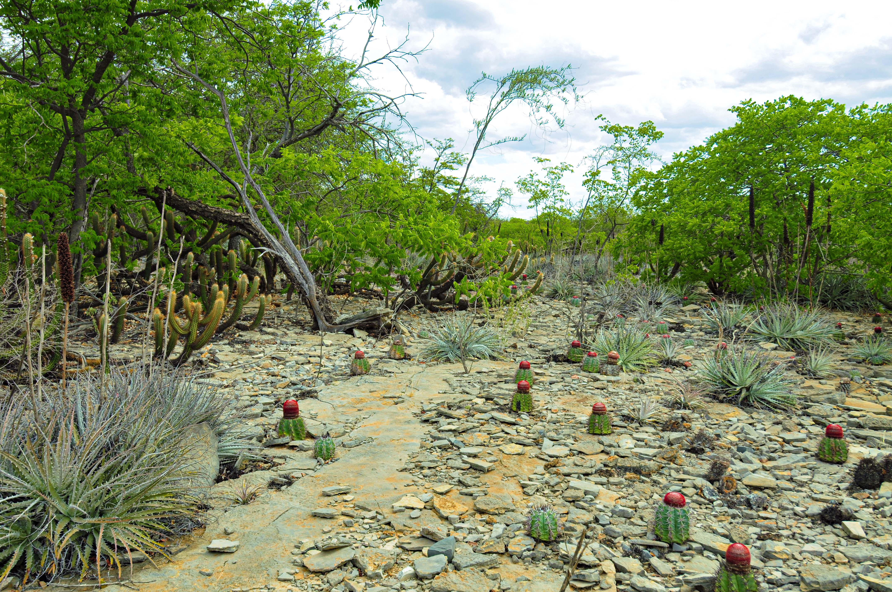

```{=html}
<link rel="preconnect" href="https://fonts.googleapis.com">
<link rel="preconnect" href="https://fonts.gstatic.com" crossorigin>
<link href="https://fonts.googleapis.com/css2?family=Montserrat:wght@400;500;600;700;800;900&family=Source+Serif+4:opsz,wght@8..60,400;8..60,600;8..60,700&family=Space+Mono:wght@400;700&display=swap" rel="stylesheet">
```

```{=html}
<style>
:root {
  --rc2-red:        #A93632;
  --rc2-red-dark:   #6E1F1D;
  --rc2-green:      #626A38;
  --rc2-green-dark: #2E3B24;
  --rc2-green-soft: #D7DDC5;
  --rc2-ochre:      #D99A27;
  --rc2-cream:      #F6F1E8;
  --rc2-paper:      #FFFDF7;
  --rc2-ink:        #171717;
  --rc2-muted:      #675F55;
  --rc2-line:       rgba(98,106,56,0.22);
  --rc2-shadow:     0 16px 34px rgba(0,0,0,0.12);

  --rc2-safe-gutter: clamp(0.75rem, 2.6vw, 2.25rem);
  --rc2-content-max: 1260px;
  --rc2-wide-max:    1480px;
  --rc2-xl-max:      1560px;
}

*, *::before, *::after {
  box-sizing: border-box;
}

html,
body {
  width: 100% !important;
  max-width: 100% !important;
  overflow-x: clip !important;
  scroll-behavior: smooth;
}

body {
  margin: 0 !important;
  background:
    linear-gradient(rgba(246,241,232,0.90), rgba(246,241,232,0.86)),
    url("figures/c2_bg.jpg");
  background-repeat: no-repeat;
  background-size: cover;
  background-attachment: fixed;
  background-position: center top;
  color: var(--rc2-ink);
  font-family: 'Montserrat', Arial, sans-serif;
}

img,
video,
iframe,
svg,
canvas {
  max-width: 100%;
}

a {
  color: var(--rc2-red);
}

#quarto-content,
#quarto-document-content,
main,
main.content,
.page-columns,
.page-columns .content {
  min-width: 0 !important;
  max-width: none !important;
  overflow-x: visible !important;
}

#quarto-content,
#quarto-document-content,
main,
main.content,
.page-columns,
.page-columns .content {
  margin-left: 0 !important;
  margin-right: 0 !important;
  padding-left: 0 !important;
  padding-right: 0 !important;
}

main.content {
  background: transparent;
  width: 100% !important;
  padding: 0 !important;
}

.quarto-title-block,
#title-block-header {
  display: none !important;
}

/* Navbar */
.navbar {
  box-shadow: 0 2px 18px rgba(0,0,0,0.10);
  backdrop-filter: blur(10px);
  -webkit-backdrop-filter: blur(10px);
}

.navbar .navbar-brand,
.navbar .nav-link {
  font-family: 'Montserrat', Arial, sans-serif;
}

.navbar .nav-link.active-section {
  color: var(--rc2-red) !important;
  font-weight: 800;
  border-bottom: 2px solid var(--rc2-red);
}

/* =========================================================
   HERO · versão limpa
   ========================================================= */
.rc2-home-hero {
  position: relative;
  left: 50%;
  right: 50%;
  width: 100vw !important;
  max-width: 100vw !important;
  min-height: calc(100svh - 88px);
  margin-top: 0 !important;
  margin-bottom: 0 !important;
  margin-left: -50vw !important;
  margin-right: -50vw !important;
  display: grid;
  align-items: center;
  overflow: hidden;
  isolation: isolate;
  background:
    linear-gradient(108deg, rgba(23,23,23,0.54) 0%, rgba(46,59,36,0.38) 48%, rgba(110,31,29,0.25) 100%),
    url("figures/c2_bg.jpg");
  background-size: cover;
  background-position: center center;
  background-repeat: no-repeat;
  color: #fff;
}

.page-columns .content > .rc2-home-hero,
#quarto-document-content > .rc2-home-hero,
main.content > .rc2-home-hero {
  grid-column: screen-start / screen-end !important;
}


.rc2-home-hero::before {
  content: "";
  position: absolute;
  inset: 0;
  z-index: 0;
  background: linear-gradient(
    180deg,
    rgba(0,0,0,0.18) 0%,
    rgba(0,0,0,0.04) 48%,
    rgba(0,0,0,0.28) 100%
  );
  pointer-events: none;
}

.rc2-home-hero-inner {
  position: relative;
  z-index: 2;
  width: min(1120px, calc(100% - var(--rc2-safe-gutter) * 2));
  margin: 0 auto;
  padding: clamp(2rem, 5vh, 4rem) 0;
  display: flex;
  align-items: center;
  justify-content: flex-start;
}

.rc2-home-brand {
  max-width: min(900px, 100%);
}

.rc2-home-copy {
  min-width: 0;
}

.rc2-home-title {
  margin: 0;
  color: #fff;
  font-family: 'Montserrat', Arial, sans-serif;
  font-size: clamp(4.4rem, 10.5vw, 10rem);
  line-height: 0.88;
  font-weight: 900;
  letter-spacing: -0.09em;
  text-transform: uppercase;
  text-shadow: 0 12px 36px rgba(0,0,0,0.50);
  animation: fadeSlideUp 0.75s 0.08s ease both;
}

.rc2-home-title .line-rede {
  color: var(--rc2-ochre);
}

.rc2-title-rule {
  width: min(270px, 42vw);
  height: 4px;
  margin: clamp(0.85rem, 1.5vw, 1.15rem) 0 clamp(0.85rem, 1.5vw, 1.1rem);
  border-radius: 999px;
  background: linear-gradient(90deg, var(--rc2-ochre), rgba(246,241,232,0.24));
  animation: fadeSlideUp 0.75s 0.16s ease both;
}

.rc2-home-subtitle {
  margin: 0;
  max-width: 820px;
  color: rgba(255,253,247,0.97);
  font-family: 'Source Serif 4', Georgia, serif;
  font-size: clamp(1.32rem, 2.55vw, 2.28rem);
  line-height: 1.16;
  font-weight: 700;
  text-shadow: 0 4px 18px rgba(0,0,0,0.48);
  animation: fadeSlideUp 0.75s 0.24s ease both;
}

/* =========================================================
   SEÇÕES
   ========================================================= */
.rc2-section,
.content-card {
  width: min(var(--rc2-content-max), calc(100% - var(--rc2-safe-gutter) * 2));
  margin: 2.4rem auto 0;
  padding: clamp(1.25rem, 3vw, 2.4rem);
  background:
    radial-gradient(circle at 100% 0%, rgba(217,154,39,0.08), transparent 32%),
    linear-gradient(180deg, rgba(255,253,247,0.96), rgba(246,241,232,0.88));
  border: 1px solid rgba(98,106,56,0.18);
  border-top: 5px solid var(--rc2-green);
  box-shadow: var(--rc2-shadow);
  overflow: hidden;
}

.rc2-section--wide {
  width: min(var(--rc2-wide-max), calc(100% - var(--rc2-safe-gutter) * 2));
}

.rc2-section--xl,
#institutions {
  width: min(var(--rc2-xl-max), calc(100% - var(--rc2-safe-gutter) * 2));
}

.rc2-section-title {
  display: grid;
  grid-template-columns: 90px 1fr;
  gap: 0.8rem;
  align-items: center;
  margin-bottom: 1.35rem;
}

.rc2-section-title::before {
  content: "";
  height: 1px;
  background: var(--rc2-ink);
  opacity: 0.72;
}

.rc2-section-title h2 {
  margin: 0;
  padding-bottom: 0.45rem;
  border-bottom: 1px solid rgba(98,106,56,0.18);
  color: var(--rc2-red);
  font-family: 'Montserrat', Arial, sans-serif;
  font-size: clamp(1.25rem, 3vw, 2.1rem);
  font-weight: 900;
  line-height: 1.05;
  letter-spacing: -0.045em;
  text-transform: uppercase;
}

.rc2-lead,
.lead {
  margin: 0 0 1.25rem 0 !important;
  padding-left: 1rem;
  border-left: 5px solid var(--rc2-ochre);
  color: #191711 !important;
  font-family: 'Source Serif 4', Georgia, serif !important;
  font-size: clamp(1.08rem, 2vw, 1.3rem) !important;
  line-height: 1.65 !important;
}

.rc2-section p,
.content-card p {
  color: var(--rc2-ink);
  font-size: 0.98rem;
  line-height: 1.72;
}

.rc2-pills {
  display: flex;
  flex-wrap: wrap;
  gap: 0.55rem;
  margin: 1.1rem 0 0;
}

.rc2-pill,
.pill {
  display: inline-flex;
  align-items: center;
  gap: 0.35rem;
  padding: 0.32rem 0.72rem;
  border-radius: 999px;
  background: rgba(246,241,232,0.84);
  border: 1.5px solid rgba(98,106,56,0.28);
  color: var(--rc2-green-dark);
  font-family: 'Space Mono', monospace;
  font-size: 0.66rem;
  font-weight: 800;
  letter-spacing: 0.07em;
  text-transform: uppercase;
}

.rc2-pill--red {
  color: var(--rc2-red);
  border-color: rgba(169,54,50,0.32);
  background: rgba(169,54,50,0.08);
}

.rc2-pill--green {
  color: var(--rc2-green-dark);
  border-color: rgba(98,106,56,0.32);
  background: rgba(98,106,56,0.09);
}

.rc2-pill--ochre {
  color: #7A5A18;
  border-color: rgba(217,154,39,0.42);
  background: rgba(217,154,39,0.10);
}

.rc2-grid-2 {
  display: grid;
  grid-template-columns: repeat(auto-fit, minmax(min(100%, 280px), 1fr));
  gap: 1rem;
}

.rc2-grid-3 {
  display: grid;
  grid-template-columns: repeat(auto-fit, minmax(min(100%, 260px), 1fr));
  gap: 1rem;
}

.rc2-grid-4 {
  display: grid;
  grid-template-columns: repeat(auto-fit, minmax(min(100%, 220px), 1fr));
  gap: 0.9rem;
}

.rc2-card,
.proto-card,
.sites-box,
.info-box {
  position: relative;
  min-width: 0;
  padding: clamp(1rem, 2vw, 1.35rem);
  border-radius: 20px;
  background: rgba(255,253,247,0.84);
  border: 1px solid var(--rc2-line);
  box-shadow: 0 10px 22px rgba(0,0,0,0.065);
  transition: transform 0.18s ease, box-shadow 0.18s ease, border-color 0.18s ease;
}

.rc2-card:hover,
.proto-card:hover,
.sites-box:hover {
  transform: translateY(-2px);
  border-color: rgba(169,54,50,0.30);
  box-shadow: 0 14px 26px rgba(0,0,0,0.10);
}

.rc2-card h3,
.proto-card h3,
.sites-box h3 {
  margin: 0 0 0.7rem 0;
  color: var(--rc2-green-dark);
  font-family: 'Space Mono', monospace;
  font-size: 0.78rem;
  font-weight: 800;
  letter-spacing: 0.11em;
  line-height: 1.25;
  text-transform: uppercase;
}

.rc2-card p,
.proto-card p,
.sites-box p {
  margin: 0;
  color: var(--rc2-muted);
  font-size: 0.92rem;
  line-height: 1.6;
}

/* =========================================================
   FEATURE BAND
   ========================================================= */
.rc2-feature-band {
  position: relative;
  width: 100vw;
  max-width: 100vw;
  margin: 2.6rem calc(50% - 50vw) 0;
  overflow: hidden;
  overflow-x: clip;
  background:
    linear-gradient(180deg, rgba(246,241,232,0.96), rgba(246,241,232,0.84)),
    url("figures/c2_bg.jpg");
  background-size: cover;
  background-position: center;
}

@supports not (overflow: clip) {
  .rc2-feature-band {
    overflow: hidden;
  }
}

.rc2-feature-title-wrap {
  width: min(var(--rc2-content-max), calc(100% - var(--rc2-safe-gutter) * 2));
  margin: 0 auto;
  padding: clamp(2rem, 4vw, 3.5rem) 0 1.15rem;
}

.rc2-feature-title {
  display: inline-flex;
  align-items: center;
  padding: 0.5rem 1rem 0.5rem 0.72rem;
  background: var(--rc2-green-dark);
  color: var(--rc2-cream);
  border: 1px solid rgba(217,154,39,0.35);
  font-size: clamp(1.4rem, 3vw, 2.5rem);
  line-height: 1;
  font-weight: 900;
  letter-spacing: -0.05em;
  text-transform: uppercase;
  box-shadow: 0 10px 24px rgba(0,0,0,0.14);
  gap: 0.72rem;
}

.rc2-feature-title-accent {
  flex-shrink: 0;
  width: 18px;
  height: 48px;
  background: repeating-linear-gradient(
    135deg,
    rgba(246,241,232,0.92) 0 3px,
    transparent 3px 6px
  );
  border-left: 4px solid var(--rc2-ochre);
}

.rc2-feature-grid {
  display: grid;
  width: 100%;
  grid-template-columns: 1fr 1fr 1fr 1fr 1fr 1fr;
  min-height: clamp(420px, 38vw, 640px);
}

.rc2-feature-photo,
.rc2-feature-panel {
  min-width: 0;
  min-height: clamp(420px, 38vw, 640px);
}

.rc2-feature-photo {
  position: relative;
  overflow: hidden;
  background: var(--rc2-green-dark);
}

.rc2-feature-photo img {
  width: 100%;
  height: 100%;
  object-fit: cover;
  object-position: center;
  display: block;
  filter: saturate(0.92) contrast(1.06);
  transition: transform 1.15s ease, filter 1.15s ease;
}

.rc2-feature-photo:hover img {
  transform: scale(1.045);
  filter: saturate(1.02) contrast(1.10);
}

.rc2-feature-photo::after {
  content: "";
  position: absolute;
  inset: 0;
  background: linear-gradient(180deg, rgba(0,0,0,0.04), rgba(0,0,0,0.22));
  pointer-events: none;
}

.rc2-feature-panel {
  position: relative;
  display: flex;
  flex-direction: column;
  justify-content: space-between;
  padding:
    clamp(1.15rem, 2vw, 1.95rem)
    clamp(0.95rem, 1.55vw, 1.35rem)
    clamp(0.9rem, 1.4vw, 1.2rem)
    clamp(0.88rem, 1.45vw, 1.2rem);
  color: #fff;
  overflow: hidden;
}

.rc2-feature-panel > * {
  position: relative;
  z-index: 1;
}

.rc2-feature-panel--sites {
  background: linear-gradient(180deg, #5F6A38 0%, #52602F 100%);
}

.rc2-feature-panel--gradients {
  background: linear-gradient(180deg, #2E3B24 0%, #26331F 100%);
}

.rc2-feature-panel--products {
  background: linear-gradient(180deg, #935912 0%, #7B261E 100%);
}

.rc2-feature-panel h3 {
  width: fit-content;
  margin: 0;
  padding: 0.42rem 0.86rem;
  background: rgba(110,31,29,0.88);
  color: var(--rc2-cream);
  border-left: 5px solid var(--rc2-ochre);
  font-family: 'Space Mono', monospace;
  font-size: 0.74rem;
  font-weight: 800;
  letter-spacing: 0.14em;
  text-transform: uppercase;
  line-height: 1.25;
}

.rc2-feature-panel p {
  margin: 0 !important;
  max-width: 13ch;
  color: rgba(255,253,247,0.98) !important;
  font-family: 'Montserrat', Arial, sans-serif !important;
  font-size: clamp(1.08rem, 1.48vw, 1.68rem) !important;
  line-height: 1.10 !important;
  font-weight: 900 !important;
  letter-spacing: -0.035em !important;
  text-transform: uppercase !important;
  text-shadow: 0 2px 8px rgba(0,0,0,0.20);
  overflow-wrap: normal;
  word-break: normal;
  hyphens: none;
}

.rc2-feature-panel-num {
  align-self: flex-end;
  color: rgba(255,255,255,0.14);
  font-family: 'Montserrat', Arial, sans-serif;
  font-size: clamp(2.6rem, 4.2vw, 4.6rem);
  font-weight: 900;
  line-height: 1;
  letter-spacing: -0.08em;
  user-select: none;
}

/* =========================================================
   ANIMAÇÕES
   ========================================================= */
@keyframes fadeSlideUp {
  from {
    opacity: 0;
    transform: translateY(24px);
  }
  to {
    opacity: 1;
    transform: translateY(0);
  }
}

.reveal-ready {
  opacity: 0;
  transform: translateY(40px);
  transition:
    opacity 0.72s ease,
    transform 0.72s cubic-bezier(.2,.7,.2,1);
  transition-delay: var(--reveal-delay, 0ms);
  will-change: opacity, transform;
}

.reveal-ready.is-visible {
  opacity: 1;
  transform: translateY(0);
}

.rc2-feature-band.reveal-ready {
  transform: translateY(42px);
}

.rc2-feature-band.reveal-ready.is-visible {
  transform: translateY(0);
}

@media (prefers-reduced-motion: reduce) {
  .reveal-ready,
  .rc2-feature-band.reveal-ready {
    opacity: 1 !important;
    transform: none !important;
    transition: none !important;
  }
}

/* =========================================================
   RESPONSIVO
   ========================================================= */
@media (max-height: 760px) and (min-width: 900px) {
  .rc2-home-hero-inner {
    padding-top: 1.4rem;
    padding-bottom: 1.4rem;
  }

  .rc2-home-title {
    font-size: clamp(3.8rem, 9.4vw, 8.4rem);
  }

  .rc2-home-subtitle {
    font-size: clamp(1.08rem, 2vw, 1.75rem);
  }
}

@media (max-width: 1180px) {
  .rc2-home-brand {
    max-width: min(820px, 100%);
  }

  .rc2-feature-grid {
    grid-template-columns: repeat(3, minmax(0, 1fr));
  }

  .rc2-feature-photo,
  .rc2-feature-panel {
    min-height: 360px;
  }

  .rc2-feature-panel {
    padding:
      1.05rem
      0.95rem
      0.9rem
      0.9rem;
  }

  .rc2-feature-panel p {
    font-size: clamp(0.98rem, 2vw, 1.32rem) !important;
    max-width: 13ch;
  }
}

@media (max-width: 980px) {
  .rc2-section-title {
    grid-template-columns: 56px 1fr;
  }
}

@media (max-width: 760px) {
  .rc2-home-hero {
    min-height: calc(100svh - 76px);
  }

  .rc2-home-hero-inner {
    align-items: center;
  }

  .rc2-home-title {
    font-size: clamp(3.4rem, 18vw, 6.2rem);
  }

  .rc2-home-subtitle {
    max-width: 20ch;
    font-size: clamp(1.15rem, 5.5vw, 1.65rem);
  }

  .rc2-feature-grid {
    grid-template-columns: 1fr;
  }

  .rc2-feature-photo,
  .rc2-feature-panel {
    min-height: 280px;
  }

  .rc2-feature-panel {
    padding: 1.25rem 1rem 1rem 1rem;
  }

  .rc2-feature-panel p {
    max-width: 20ch;
    font-size: clamp(1.08rem, 5.2vw, 1.55rem) !important;
  }
}

@media (max-width: 680px) {
  .rc2-feature-title {
    font-size: clamp(1.2rem, 8vw, 1.85rem);
  }

  .rc2-feature-title-accent {
    height: 38px;
  }

  .rc2-section-title {
    grid-template-columns: 34px 1fr;
  }
}

@media (max-width: 420px) {
  :root {
    --rc2-safe-gutter: 0.65rem;
  }

  .rc2-section,
  .content-card {
    padding: clamp(1rem, 4vw, 1.35rem);
    border-radius: 22px;
  }

  .rc2-home-title {
    font-size: clamp(3.1rem, 17vw, 4.8rem);
  }

  .rc2-home-logo-card {
    width: min(165px, 48vw);
  }
}

/* =========================================================
   INSTITUIÇÕES
   ========================================================= */
.inst-grid pre {
  display: none !important;
}

.inst-grid {
  display: grid;
  grid-template-columns: repeat(auto-fit, minmax(min(100%, 180px), 1fr));
  gap: clamp(0.65rem, 1.2vw, 0.95rem);
  margin-top: 1rem;
  align-items: stretch;
}

.inst-item {
  min-width: 0;
  max-width: 100%;
  display: flex;
  flex-direction: column;
  align-items: center;
  justify-content: center;
  gap: 0.58rem;
  padding: clamp(0.85rem, 1.2vw, 1.05rem);
  min-height: 122px;
  border-radius: 20px;
  background: rgba(255,253,247,0.88);
  border: 1px solid rgba(98,106,56,0.18);
  text-decoration: none;
  transition: transform 0.18s ease, box-shadow 0.18s ease;
}

.inst-item:hover {
  transform: translateY(-2px);
  box-shadow: 0 12px 24px rgba(0,0,0,0.10);
}

.inst-logo {
  width: 100%;
  height: clamp(56px, 5vw, 76px);
  object-fit: contain;
}

.inst-name {
  font-family: 'Space Mono', monospace;
  font-size: 0.62rem;
  line-height: 1.22;
  font-weight: 800;
  letter-spacing: 0.05em;
  text-transform: uppercase;
  color: #2E3B24;
  text-align: center;
  overflow-wrap: anywhere;
}

@media (max-width: 640px) {
  .inst-grid {
    grid-template-columns: repeat(2, minmax(0, 1fr));
  }
}

@media (max-width: 380px) {
  .inst-grid {
    grid-template-columns: 1fr;
  }
}

.html-widget,
.leaflet,
.leaflet-container,
iframe {
  width: 100% !important;
  max-width: 100% !important;
}

/* =========================================================
   OVERVIEW FIRST FOLD · full width, conteúdo no primeiro frame
   ========================================================= */
.rc2-overview-fold {
  position: relative;
  width: 100vw !important;
  max-width: 100vw !important;
  margin-top: 0 !important;
  margin-left: calc(50% - 50vw) !important;
  margin-right: calc(50% - 50vw) !important;
  padding: 0 !important;
  overflow: hidden !important;
  isolation: isolate;
}

.page-columns .content > .rc2-overview-fold,
#quarto-document-content > .rc2-overview-fold,
main.content > .rc2-overview-fold {
  grid-column: screen-start / screen-end !important;
}

.rc2-overview-media {
  position: relative;
  width: 100% !important;
  max-width: 100% !important;
  min-height: clamp(320px, 42svh, 460px);
  margin: 0 !important;
  padding: 0 !important;
  display: grid;
  align-items: center;
  overflow: hidden;
  color: #fff;
  background:
    radial-gradient(circle at 86% 18%, rgba(217,154,39,0.26), transparent 32%),
    linear-gradient(106deg, rgba(23,23,23,0.74) 0%, rgba(46,59,36,0.48) 50%, rgba(110,31,29,0.30) 100%),
    url("figures/c2_bg.jpg");
  background-size: cover !important;
  background-position: center center !important;
  background-repeat: no-repeat !important;
}

.rc2-overview-media::before {
  content: "";
  position: absolute;
  inset: 0;
  z-index: 0;
  background: linear-gradient(
    180deg,
    rgba(0,0,0,0.14) 0%,
    rgba(0,0,0,0.04) 45%,
    rgba(0,0,0,0.48) 100%
  );
  pointer-events: none;
}

.rc2-overview-media-inner {
  position: relative;
  z-index: 2;
  width: min(1260px, calc(100vw - var(--rc2-safe-gutter) * 2));
  max-width: calc(100vw - var(--rc2-safe-gutter) * 2);
  margin: 0 auto;
  padding: clamp(2.1rem, 4.2vw, 3.5rem) 0 clamp(5.2rem, 8vw, 6.4rem);
}

.rc2-overview-brand {
  margin: 0;
  color: #fff;
  font-family: 'Montserrat', Arial, sans-serif;
  font-size: clamp(3.2rem, 7.4vw, 7.1rem);
  line-height: 0.82;
  font-weight: 900;
  letter-spacing: -0.10em;
  text-transform: uppercase;
  text-shadow: 0 12px 42px rgba(0,0,0,0.56);
}

.rc2-overview-brand .line-rede {
  display: block;
  color: #fff;
}

.rc2-overview-brand .line-c2 {
  display: block;
  margin-left: clamp(1rem, 5vw, 4.5rem);
  color: var(--rc2-ochre);
}

.rc2-overview-title-rule {
  width: min(420px, 52vw);
  height: 5px;
  margin: clamp(0.8rem, 1.5vw, 1.05rem) 0 clamp(0.72rem, 1.25vw, 1rem);
  border-radius: 999px;
  background: linear-gradient(90deg, var(--rc2-ochre) 0%, rgba(217,154,39,0.62) 42%, rgba(255,253,247,0.12) 100%);
  box-shadow: 0 6px 18px rgba(0,0,0,0.26);
}

.rc2-overview-image-title {
  margin: 0 0 0.42rem;
  color: rgba(255,253,247,0.98);
  font-family: 'Montserrat', Arial, sans-serif;
  font-size: clamp(0.96rem, 1.45vw, 1.28rem);
  line-height: 1.1;
  font-weight: 900;
  letter-spacing: 0.07em;
  text-transform: uppercase;
  text-shadow: 0 8px 30px rgba(0,0,0,0.48);
}

.rc2-overview-image-subtitle {
  margin: 0;
  max-width: 760px;
  color: rgba(255,253,247,0.95);
  font-family: 'Source Serif 4', Georgia, serif;
  font-size: clamp(0.96rem, 1.45vw, 1.18rem);
  line-height: 1.28;
  font-weight: 700;
  text-shadow: 0 4px 18px rgba(0,0,0,0.50);
}

.rc2-overview-wave {
  position: absolute;
  left: 0;
  right: 0;
  bottom: -1px;
  z-index: 3;
  width: 100%;
  height: clamp(82px, 10vw, 145px);
  display: block;
  color: rgba(255,253,247,0.96);
  filter: drop-shadow(0 -10px 18px rgba(0,0,0,0.10));
}

.rc2-overview-content-wrap {
  position: relative;
  z-index: 4;
  width: 100% !important;
  max-width: 100% !important;
  margin: -1px 0 0 0 !important;
  padding: clamp(0.38rem, 0.8vw, 0.68rem) 0 clamp(0.75rem, 1.25vw, 1.05rem);
  overflow: visible;
  background: linear-gradient(180deg, rgba(255,253,247,0.96), rgba(246,241,232,0.88));
}

.rc2-overview-content {
  width: min(1260px, calc(100vw - var(--rc2-safe-gutter) * 2));
  max-width: calc(100vw - var(--rc2-safe-gutter) * 2);
  margin: 0 auto;
  display: grid;
  grid-template-columns: minmax(0, 1.15fr) minmax(250px, 0.46fr);
  gap: clamp(0.9rem, 1.8vw, 1.35rem);
  align-items: start;
}

.rc2-overview-main {
  min-width: 0;
}

.rc2-overview-lead {
  margin: 0 0 0.38rem 0 !important;
  padding-left: 1rem;
  border-left: 5px solid var(--rc2-ochre);
  color: #191711 !important;
  font-family: 'Source Serif 4', Georgia, serif !important;
  font-size: clamp(0.88rem, 1.05vw, 0.98rem) !important;
  line-height: 1.27 !important;
}

.rc2-overview-content p {
  color: var(--rc2-ink);
  font-size: clamp(0.76rem, 0.86vw, 0.84rem);
  line-height: 1.28;
  margin: 0 0 0.36rem;
}

.rc2-overview-focus {
  min-width: 0;
  margin-top: clamp(-4rem, -4.2vw, -1.4rem);
  padding-top: 0.5rem;
  border-top: 1px solid rgba(98,106,56,0.20);
}

.rc2-overview-focus h3 {
  margin: 0 0 0.36rem 0;
  color: var(--rc2-green-dark);
  font-family: 'Space Mono', monospace;
  font-size: 0.62rem;
  font-weight: 800;
  letter-spacing: 0.11em;
  line-height: 1.25;
  text-transform: uppercase;
}

.rc2-overview-focus p {
  margin: 0;
  color: var(--rc2-muted);
  font-size: clamp(0.74rem, 0.84vw, 0.82rem);
  line-height: 1.28;
}

.rc2-overview-focus .rc2-pills {
  display: none !important;
}

/* evita que o bloco seguinte use margem full-bleed acumulada à esquerda */
.rc2-feature-band {
  width: 100vw !important;
  max-width: 100vw !important;
  margin-left: calc(50% - 50vw) !important;
  margin-right: calc(50% - 50vw) !important;
  overflow-x: hidden !important;
}

@media (min-width: 1100px) and (max-height: 850px) {
  .rc2-overview-media {
    min-height: clamp(310px, 39svh, 410px);
  }

  .rc2-overview-media-inner {
    padding-top: clamp(1.8rem, 3vw, 2.6rem);
    padding-bottom: clamp(4.5rem, 7vw, 5.6rem);
  }

  .rc2-overview-brand {
    font-size: clamp(3rem, 6.4vw, 6.1rem);
  }

  .rc2-overview-title-rule {
    margin-top: 0.72rem;
    margin-bottom: 0.62rem;
  }
}

@media (max-width: 980px) {
  .rc2-overview-content {
    grid-template-columns: 1fr;
  }

  .rc2-overview-focus {
    margin-top: 0;
  }
}

@media (max-width: 700px) {
  .rc2-overview-media {
    min-height: calc(100svh - 76px);
  }

  .rc2-overview-media-inner {
    padding-top: 2.6rem;
    padding-bottom: 6.2rem;
  }

  .rc2-overview-brand {
    font-size: clamp(3.25rem, 17vw, 5.8rem);
    line-height: 0.86;
  }

  .rc2-overview-brand .line-c2 {
    margin-left: clamp(0.8rem, 8vw, 2.4rem);
  }

  .rc2-overview-title-rule {
    width: min(280px, 70vw);
  }

  .rc2-overview-image-title {
    max-width: 19ch;
    font-size: clamp(0.95rem, 4.6vw, 1.25rem);
  }

  .rc2-overview-image-subtitle {
    max-width: 24ch;
    font-size: clamp(1rem, 4.8vw, 1.28rem);
  }

  .rc2-overview-wave {
    height: clamp(92px, 19vw, 135px);
  }

  .rc2-overview-content p {
    font-size: 0.88rem;
    line-height: 1.45;
  }
}


/* =========================================================
   FIX FINAL VISUAL FULL-BLEED
   Usa pseudo-elementos para pintar a imagem em 100vw,
   sem depender do Quarto aceitar o bloco como full-width.
   ========================================================= */
html,
body {
  overflow-x: hidden !important;
}

/* O wrapper pode estar preso na coluna; a pintura do hero sangra para fora */
.rc2-overview-fold {
  overflow: visible !important;
}

/* Remove a imagem do box central e pinta a foto em 100vw via ::after */
.rc2-overview-media {
  position: relative !important;
  overflow: visible !important;
  background: none !important;
  isolation: isolate !important;
}

/* Foto full-bleed real, atravessando as laterais do frame */
.rc2-overview-media::after {
  content: "";
  position: absolute;
  top: 0;
  bottom: 0;
  left: -100vmax;
  right: -100vmax;
  z-index: 0;
  background:
    radial-gradient(circle at 86% 18%, rgba(217,154,39,0.26), transparent 32%),
    linear-gradient(106deg, rgba(23,23,23,0.74) 0%, rgba(46,59,36,0.48) 50%, rgba(110,31,29,0.30) 100%),
    url("figures/c2_bg.jpg");
  background-size: cover;
  background-position: center center;
  background-repeat: no-repeat;
}

/* Overlay escuro também sangra para as laterais */
.rc2-overview-media::before {
  left: -100vmax !important;
  right: -100vmax !important;
  top: 0 !important;
  bottom: 0 !important;
  inset: 0 -100vmax 0 -100vmax !important;
  z-index: 1 !important;
}

/* Conteúdo e onda acima da pintura full-bleed */
.rc2-overview-media-inner {
  position: relative !important;
  z-index: 2 !important;
}

.rc2-overview-wave {
  left: -100vmax !important;
  right: -100vmax !important;
  width: auto !important;
  min-width: calc(100% + 200vmax) !important;
  z-index: 3 !important;
}

/* O branco sob a onda também precisa ocupar toda a largura visual */
.rc2-overview-content-wrap {
  overflow: visible !important;
  box-shadow: 0 0 0 100vmax rgba(255,253,247,0.96);
  clip-path: inset(0 -100vmax);
}

/* Sobe o foco científico para acompanhar melhor a diagonal */
.rc2-overview-focus {
  margin-top: clamp(-5.2rem, -4.8vw, -1.8rem) !important;
}

/* O bloco seguinte não deve herdar escape lateral */
.rc2-feature-band {
  margin-left: 0 !important;
  margin-right: 0 !important;
  width: 100% !important;
  max-width: 100% !important;
  overflow-x: hidden !important;
}

@media (max-width: 980px) {
  .rc2-overview-focus {
    margin-top: 0 !important;
  }
}


/* =========================================================
   PATCH · remove faixa acima do hero e corrige scientific focus
   ========================================================= */

/* aproxima o hero do navbar, removendo a faixa clara acima da imagem */
.rc2-overview-fold {
  margin-top: -1.55rem !important;
}

/* garante leitura confortável sem perder o primeiro frame */
.rc2-overview-media {
  min-height: clamp(355px, 44svh, 480px) !important;
}

/* mantém a imagem visualmente cheia logo abaixo do navbar */
.rc2-overview-media-inner {
  padding-top: clamp(2.2rem, 4vw, 3.1rem) !important;
  padding-bottom: clamp(5rem, 7.5vw, 6rem) !important;
}

/* dá mais respiro à transição branca abaixo da onda */
.rc2-overview-content-wrap {
  padding-top: clamp(0.9rem, 1.25vw, 1.15rem) !important;
}

/* evita que o texto do foco científico suba demais e seja cortado */
.rc2-overview-focus {
  margin-top: clamp(-1.6rem, -1.8vw, -0.45rem) !important;
  padding-top: 0.8rem !important;
}

.rc2-overview-focus p {
  line-height: 1.34 !important;
}

/* evita qualquer recorte lateral ou escape do bloco seguinte */
.rc2-feature-band {
  margin-left: 0 !important;
  margin-right: 0 !important;
  transform: none !important;
}

@media (max-width: 980px) {
  .rc2-overview-fold {
    margin-top: -1.1rem !important;
  }

  .rc2-overview-focus {
    margin-top: 0 !important;
    padding-top: 0.35rem !important;
  }
}

@media (max-width: 700px) {
  .rc2-overview-fold {
    margin-top: -0.9rem !important;
  }

  .rc2-overview-media {
    min-height: calc(100svh - 68px) !important;
  }
}


/* =========================================================
   EIXOS DA REDE · estética editorial em seis faixas
   ========================================================= */

/* Mantém a abertura inteira no primeiro frame do desktop. */
@media (min-width: 1181px) {
  .rc2-overview-fold {
    min-height: calc(100svh - 76px) !important;
    display: flex !important;
    flex-direction: column !important;
  }

  .rc2-overview-media {
    flex: 1 1 auto !important;
  }

  .rc2-overview-content-wrap {
    flex: 0 0 auto !important;
  }
}

/* A seção seguinte ocupa o segundo frame e toda a largura da tela. */
.rc2-feature-band {
  position: relative !important;
  left: 50% !important;
  width: 100vw !important;
  max-width: 100vw !important;
  margin: 0 !important;
  transform: translateX(-50%) !important;
  overflow: hidden !important;
  isolation: isolate;
  background: #F6F1E8 !important;
}

/* Faixas geométricas inspiradas na referência visual. */
.rc2-feature-band::before,
.rc2-feature-band::after {
  content: "";
  position: absolute;
  left: 0;
  width: 100%;
  height: clamp(22px, 2vw, 34px);
  z-index: 5;
  pointer-events: none;
  opacity: 0.78;
  background:
    linear-gradient(135deg, rgba(169,54,50,0.14) 25%, transparent 25%) 0 0 / 42px 42px,
    linear-gradient(225deg, rgba(169,54,50,0.14) 25%, transparent 25%) 0 0 / 42px 42px,
    linear-gradient(315deg, rgba(98,106,56,0.10) 25%, transparent 25%) 21px 0 / 42px 42px,
    linear-gradient(45deg,  rgba(98,106,56,0.10) 25%, transparent 25%) 21px 0 / 42px 42px,
    #F6F1E8;
}

.rc2-feature-band::before {
  top: 0;
}

.rc2-feature-band::after {
  bottom: 0;
  transform: rotate(180deg);
}

.rc2-feature-title-wrap {
  position: relative;
  z-index: 6;
  width: 100% !important;
  max-width: 100% !important;
  margin: 0 !important;
  padding:
    clamp(3.1rem, 6vh, 4.7rem)
    var(--rc2-safe-gutter)
    clamp(1.35rem, 2.3vh, 2rem) !important;
}

.rc2-feature-title {
  display: flex !important;
  width: fit-content;
  max-width: 100% !important;
  padding: 0 !important;
  border: 0 !important;
  background: transparent !important;
  box-shadow: none !important;
  color: var(--rc2-green-dark) !important;
  font-size: clamp(2rem, 3.25vw, 3.65rem) !important;
  line-height: 0.96 !important;
  letter-spacing: -0.06em !important;
}

.rc2-feature-title-accent {
  width: 7px !important;
  height: clamp(42px, 4vw, 62px) !important;
  border-left: 0 !important;
  background:
    repeating-linear-gradient(
      135deg,
      var(--rc2-ochre) 0 4px,
      var(--rc2-green-dark) 4px 8px
    ) !important;
}

/* Cada eixo contém uma foto e um painel de texto. */
.rc2-feature-grid {
  position: relative;
  z-index: 2;
  display: grid !important;
  width: 100% !important;
  max-width: 100% !important;
  margin: 0 !important;
  gap: 0 !important;
}

.rc2-axis {
  min-width: 0;
  display: grid;
  grid-template-columns: minmax(0, 1fr) minmax(0, 1fr);
  overflow: hidden;
}

.rc2-axis-photo {
  position: relative;
  min-width: 0;
  min-height: 100%;
  overflow: hidden;
  background: var(--rc2-green-dark);
}

.rc2-axis-photo img {
  width: 100%;
  height: 100%;
  min-height: 100%;
  display: block;
  object-fit: cover;
  object-position: center;
  filter: saturate(0.92) contrast(1.06);
  transition: transform 0.9s ease, filter 0.9s ease;
}

.rc2-axis:hover .rc2-axis-photo img {
  transform: scale(1.035);
  filter: saturate(1.02) contrast(1.09);
}

.rc2-axis-photo::before {
  content: "";
  position: absolute;
  inset: 0;
  z-index: 1;
  background: linear-gradient(180deg, rgba(0,0,0,0.02), rgba(0,0,0,0.20));
  pointer-events: none;
}

/* Textura geométrica discreta no eixo central. */
.rc2-axis--gradients .rc2-axis-photo::after {
  content: "";
  position: absolute;
  inset: 0;
  z-index: 2;
  opacity: 0.22;
  pointer-events: none;
  background:
    linear-gradient(45deg, transparent 42%, rgba(217,154,39,0.42) 42% 48%, transparent 48%) 0 0 / 76px 76px,
    linear-gradient(-45deg, transparent 42%, rgba(246,241,232,0.28) 42% 48%, transparent 48%) 0 0 / 76px 76px;
}

.rc2-axis-panel {
  position: relative;
  min-width: 0;
  display: flex;
  flex-direction: column;
  padding:
    clamp(1.45rem, 2.4vw, 2.7rem)
    clamp(1.25rem, 2.1vw, 2.35rem)
    clamp(1.15rem, 2vw, 2rem);
  overflow: hidden;
  color: #fff;
}

.rc2-axis--sites .rc2-axis-panel {
  background: linear-gradient(180deg, #626C3D 0%, #53602F 100%);
}

.rc2-axis--gradients .rc2-axis-panel {
  background: linear-gradient(180deg, #33452A 0%, #25361F 100%);
}

.rc2-axis--synthesis .rc2-axis-panel {
  background: linear-gradient(180deg, #9A5C18 0%, #7F2A20 100%);
}

.rc2-axis-kicker {
  align-self: flex-start;
  margin: 0;
  padding: 0.42rem 0.78rem;
  border-left: 5px solid var(--rc2-ochre);
  background: rgba(110,31,29,0.92);
  color: var(--rc2-cream);
  font-family: 'Space Mono', monospace;
  font-size: clamp(0.68rem, 0.72vw, 0.82rem);
  font-weight: 800;
  line-height: 1.2;
  letter-spacing: 0.13em;
  text-transform: uppercase;
}

.rc2-axis-copy {
  margin: auto 0;
  padding: clamp(1.5rem, 3vh, 2.6rem) 0;
}

.rc2-axis-copy h3 {
  max-width: 14ch;
  margin: 0 0 clamp(0.8rem, 1.5vh, 1.2rem);
  color: #fff;
  font-family: 'Montserrat', Arial, sans-serif;
  font-size: clamp(1.28rem, 1.52vw, 1.85rem);
  font-weight: 900;
  line-height: 1.04;
  letter-spacing: -0.045em;
}

.rc2-axis-copy p {
  max-width: 27ch;
  margin: 0 !important;
  color: rgba(255,253,247,0.96) !important;
  font-family: 'Montserrat', Arial, sans-serif !important;
  font-size: clamp(0.84rem, 0.92vw, 1rem) !important;
  font-weight: 600 !important;
  line-height: 1.42 !important;
  letter-spacing: -0.012em !important;
  text-transform: none !important;
  overflow-wrap: normal !important;
  word-break: normal !important;
}

.rc2-axis-number {
  align-self: flex-end;
  margin-top: auto;
  color: rgba(255,255,255,0.16);
  font-family: 'Montserrat', Arial, sans-serif;
  font-size: clamp(3.5rem, 5vw, 6.3rem);
  font-weight: 900;
  line-height: 0.8;
  letter-spacing: -0.09em;
  user-select: none;
}

/* Segundo frame completo em monitores de mesa. */
@media (min-width: 1181px) {
  .rc2-feature-band {
    min-height: calc(100svh - 76px) !important;
    display: flex !important;
    flex-direction: column !important;
  }

  .rc2-feature-grid {
    flex: 1 1 auto;
    grid-template-columns: repeat(3, minmax(0, 1fr)) !important;
    padding-bottom: clamp(2.1rem, 3vw, 3rem);
  }

  .rc2-axis {
    min-height: clamp(520px, 68vh, 760px);
  }
}

/* Telas largas e baixas: reduz tipografia sem cortar o conteúdo. */
@media (min-width: 1181px) and (max-height: 820px) {
  .rc2-feature-title-wrap {
    padding-top: 2.65rem !important;
    padding-bottom: 1rem !important;
  }

  .rc2-feature-title {
    font-size: clamp(1.85rem, 2.7vw, 2.9rem) !important;
  }

  .rc2-axis {
    min-height: clamp(440px, 63vh, 570px);
  }

  .rc2-axis-panel {
    padding: 1.25rem 1.25rem 1rem;
  }

  .rc2-axis-copy {
    padding: 1rem 0;
  }

  .rc2-axis-copy h3 {
    font-size: clamp(1.08rem, 1.25vw, 1.48rem);
  }

  .rc2-axis-copy p {
    font-size: clamp(0.76rem, 0.78vw, 0.88rem) !important;
    line-height: 1.34 !important;
  }

  .rc2-axis-number {
    font-size: clamp(3rem, 4vw, 4.8rem);
  }
}

/* Tablet: cada eixo ocupa uma linha, ainda com foto e texto lado a lado. */
@media (max-width: 1180px) {
  .rc2-feature-band {
    left: 50% !important;
    width: 100vw !important;
    max-width: 100vw !important;
    transform: translateX(-50%) !important;
  }

  .rc2-feature-grid {
    grid-template-columns: 1fr !important;
    padding-bottom: 2rem;
  }

  .rc2-axis {
    min-height: 430px;
  }

  .rc2-axis-copy h3 {
    max-width: 18ch;
    font-size: clamp(1.25rem, 2.5vw, 1.75rem);
  }

  .rc2-axis-copy p {
    max-width: 36ch;
    font-size: clamp(0.86rem, 1.5vw, 1rem) !important;
  }
}

/* Celular: foto acima e texto abaixo. */
@media (max-width: 700px) {
  .rc2-feature-title-wrap {
    padding-top: 3rem !important;
  }

  .rc2-feature-title {
    font-size: clamp(1.55rem, 8vw, 2.25rem) !important;
  }

  .rc2-axis {
    grid-template-columns: 1fr;
    min-height: 0;
  }

  .rc2-axis-photo {
    min-height: 300px;
  }

  .rc2-axis-panel {
    min-height: 350px;
  }

  .rc2-axis-copy h3 {
    max-width: 20ch;
    font-size: clamp(1.4rem, 6vw, 1.85rem);
  }

  .rc2-axis-copy p {
    max-width: 34ch;
    font-size: clamp(0.9rem, 4vw, 1rem) !important;
  }
}


/* =========================================================
   HOME · links ativos, cinco cartões e subtítulo em duas linhas
   ========================================================= */
.rc2-subtitle-break {
  display: block;
  margin-top: 0.55rem;
}

.rc2-grid-5 {
  display: grid;
  grid-template-columns: repeat(auto-fit, minmax(min(100%, 205px), 1fr));
  gap: 0.9rem;
}

.rc2-card-link {
  display: block;
  color: inherit;
  text-decoration: none;
  cursor: pointer;
}

.rc2-card-link::after {
  content: "↗";
  position: absolute;
  top: 1rem;
  right: 1rem;
  color: var(--rc2-red);
  font-family: 'Space Mono', monospace;
  font-size: 0.9rem;
  font-weight: 700;
  opacity: 0.72;
  transition: transform 0.18s ease, opacity 0.18s ease;
}

.rc2-card-link:hover::after,
.rc2-card-link:focus-visible::after {
  transform: translate(2px, -2px);
  opacity: 1;
}

.rc2-card-link:focus-visible {
  outline: 3px solid rgba(217,154,39,0.72);
  outline-offset: 4px;
}

.rc2-axis-kicker {
  color: var(--rc2-cream) !important;
  text-decoration: none !important;
  cursor: pointer;
}

.rc2-axis-kicker::after {
  content: "↗";
  display: inline-block;
  margin-left: 0.42rem;
  transition: transform 0.18s ease;
}

.rc2-axis-kicker:hover::after,
.rc2-axis-kicker:focus-visible::after {
  transform: translate(2px, -2px);
}

.rc2-axis-kicker:focus-visible {
  outline: 3px solid rgba(255,253,247,0.82);
  outline-offset: 4px;
}

.partner-no-link {
  color: var(--rc2-ink);
  font-weight: 600;
}

@media (max-width: 760px) {
  .rc2-grid-5 {
    grid-template-columns: 1fr;
  }
}


/* =========================================================
   INSTITUTIONS, PEOPLE AND CONTACT
   ========================================================= */
.rc2-institutions-intro {
  display: flex;
  align-items: center;
  justify-content: space-between;
  gap: 1.2rem;
  margin: 0 0 1.2rem;
  padding: 1rem 1.1rem;
  border-left: 5px solid var(--rc2-ochre);
  background: rgba(255,253,247,0.62);
}

.rc2-institutions-intro p {
  max-width: 760px;
  margin: 0 !important;
}

.rc2-btn,
.rc2-team-cta,
.rc2-contact-toggle,
.rc2-contact-submit {
  appearance: none;
  display: inline-flex;
  align-items: center;
  justify-content: center;
  gap: 0.5rem;
  min-height: 44px;
  padding: 0.72rem 1rem;
  border: 1px solid rgba(169,54,50,0.34);
  border-radius: 999px;
  background: var(--rc2-red);
  color: #fff !important;
  font-family: 'Space Mono', monospace;
  font-size: 0.72rem;
  font-weight: 800;
  line-height: 1.2;
  letter-spacing: 0.08em;
  text-decoration: none !important;
  text-transform: uppercase;
  cursor: pointer;
  box-shadow: 0 8px 18px rgba(110,31,29,0.16);
  transition:
    transform 0.18s ease,
    box-shadow 0.18s ease,
    background-color 0.18s ease;
}

.rc2-btn:hover,
.rc2-team-cta:hover,
.rc2-contact-toggle:hover,
.rc2-contact-submit:hover {
  transform: translateY(-2px);
  background: var(--rc2-red-dark);
  box-shadow: 0 12px 22px rgba(110,31,29,0.22);
}

.rc2-btn:focus-visible,
.rc2-team-cta:focus-visible,
.rc2-contact-toggle:focus-visible,
.rc2-contact-submit:focus-visible,
.rc2-contact-form input:focus-visible,
.rc2-contact-form textarea:focus-visible {
  outline: 3px solid rgba(217,154,39,0.72);
  outline-offset: 3px;
}

.rc2-contact-section {
  margin-bottom: 2.6rem;
}

.rc2-contact-summary {
  display: grid;
  grid-template-columns: minmax(0, 1fr) auto;
  gap: 1.2rem;
  align-items: center;
}

.rc2-contact-summary h2 {
  margin: 0 0 0.55rem;
  color: var(--rc2-green-dark);
  font-family: 'Montserrat', Arial, sans-serif;
  font-size: clamp(1.35rem, 2.6vw, 2rem);
  font-weight: 900;
  line-height: 1.05;
  letter-spacing: -0.04em;
}

.rc2-contact-summary p {
  max-width: 760px;
  margin: 0 !important;
}

.rc2-contact-panel {
  margin-top: 1.25rem;
  padding-top: 1.25rem;
  border-top: 1px solid var(--rc2-line);
}

.rc2-contact-panel[hidden] {
  display: none !important;
}

.rc2-contact-panel h3 {
  margin: 0 0 0.45rem;
  color: var(--rc2-red);
  font-family: 'Montserrat', Arial, sans-serif;
  font-size: clamp(1.25rem, 2.5vw, 1.8rem);
  font-weight: 900;
  letter-spacing: -0.035em;
}

.rc2-contact-panel > p {
  margin-top: 0 !important;
}

.rc2-contact-form {
  display: grid;
  grid-template-columns: repeat(2, minmax(0, 1fr));
  gap: 1rem;
  margin-top: 1.1rem;
}

.rc2-form-field {
  min-width: 0;
}

.rc2-form-field--full {
  grid-column: 1 / -1;
}

.rc2-form-field label {
  display: block;
  margin-bottom: 0.42rem;
  color: var(--rc2-green-dark);
  font-family: 'Space Mono', monospace;
  font-size: 0.68rem;
  font-weight: 800;
  letter-spacing: 0.08em;
  text-transform: uppercase;
}

.rc2-contact-form input,
.rc2-contact-form textarea {
  width: 100%;
  border: 1px solid rgba(98,106,56,0.28);
  border-radius: 14px;
  background: rgba(255,253,247,0.94);
  color: var(--rc2-ink);
  font-family: 'Montserrat', Arial, sans-serif;
  font-size: 0.95rem;
  line-height: 1.45;
  padding: 0.82rem 0.9rem;
  box-shadow: inset 0 1px 0 rgba(255,255,255,0.72);
}

.rc2-contact-form textarea {
  min-height: 170px;
  resize: vertical;
}

.rc2-contact-actions {
  grid-column: 1 / -1;
  display: flex;
  flex-wrap: wrap;
  align-items: center;
  gap: 0.85rem;
}

.rc2-contact-submit[disabled] {
  opacity: 0.64;
  cursor: wait;
  transform: none;
}

.rc2-contact-status {
  min-height: 1.4em;
  margin: 0 !important;
  font-size: 0.86rem !important;
  font-weight: 700;
}

.rc2-contact-status[data-state="success"] {
  color: #2E6B3A;
}

.rc2-contact-status[data-state="error"] {
  color: var(--rc2-red);
}

.rc2-form-note {
  grid-column: 1 / -1;
  margin: 0 !important;
  color: var(--rc2-muted) !important;
  font-size: 0.78rem !important;
  line-height: 1.45 !important;
}

.rc2-honeypot {
  position: absolute !important;
  left: -9999px !important;
  width: 1px !important;
  height: 1px !important;
  overflow: hidden !important;
}

@media (max-width: 760px) {
  .rc2-institutions-intro,
  .rc2-contact-summary {
    grid-template-columns: 1fr;
    display: grid;
  }

  .rc2-institutions-intro {
    align-items: start;
  }

  .rc2-team-cta,
  .rc2-contact-toggle {
    width: 100%;
  }

  .rc2-contact-form {
    grid-template-columns: 1fr;
  }

  .rc2-form-field--full,
  .rc2-contact-actions,
  .rc2-form-note {
    grid-column: 1;
  }
}

</style>
```

```{=html}
<section class="rc2-overview-fold" id="inicio" aria-label="RedeC2 homepage overview">
  <div class="rc2-overview-media" aria-label="RedeC2 image banner">
    <div class="rc2-overview-media-inner">
      <h1 class="rc2-overview-brand">
        <span class="line-rede">Rede</span>
        <span class="line-c2">C2</span>
      </h1>

      <div class="rc2-overview-title-rule" aria-hidden="true"></div>

      <h2 class="rc2-overview-image-title">The RedeC2 network</h2>

      <p class="rc2-overview-image-subtitle">
        Rede C2 - Permanent plots for understanding vegetation dynamics across Brazil's seasonally dry ecosystems.
        <span class="rc2-subtitle-break">We currently focus on the Caatinga and Cerrado.</span>
      </p>
    </div>

    <svg class="rc2-overview-wave" viewBox="0 0 1440 145" preserveAspectRatio="none" aria-hidden="true">
      <path fill="currentColor" d="M0,118 C170,138 330,110 515,100 C690,90 820,134 985,86 C1160,35 1285,48 1440,8 L1440,145 L0,145 Z"></path>
    </svg>
  </div>

  <div class="rc2-overview-content-wrap" id="rede">
    <div class="rc2-overview-content">
      <div class="rc2-overview-main">
        <p class="rc2-overview-lead">
          <strong>RedeC2</strong> is a collaborative research network dedicated to
          understanding the multifunctional dynamics of Brazil's seasonally dry
          tropical ecosystems, especially Caatinga and Cerrado.
        </p>

        <p>
          Bringing together researchers from multiple institutions, the network
          integrates permanent plots, floristic inventories, functional traits and
          environmental data to investigate how plant communities are structured
          and how they respond to climatic seasonality, soil conditions and
          landscape context.
        </p>

        <p>
          Across different sites and regions, RedeC2 studies how natural gradients
          and human-driven disturbances influence vegetation structure,
          successional pathways and the spatial turnover of species.
        </p>
      </div>

      <aside class="rc2-overview-focus">
        <h3>Scientific focus</h3>
        <p>
          RedeC2 connects long-term vegetation monitoring, ecological gradients,
          taxonomic knowledge and reproducible workflows to support synthesis
          across Caatinga and Cerrado sites.
        </p>
      </aside>
    </div>
  </div>
</section>
```

```{=html}
<section class="rc2-feature-band" id="eixos" aria-label="RedeC2 working axes">

  <div class="rc2-feature-title-wrap">
    <div class="rc2-feature-title">
      <span class="rc2-feature-title-accent" aria-hidden="true"></span>
      Sites, gradients and synthesis
    </div>
  </div>

  <div class="rc2-feature-grid">

    <article class="rc2-axis rc2-axis--sites" aria-label="Sites">
      <div class="rc2-axis-photo">
        
      </div>

      <div class="rc2-axis-panel">
        <a class="rc2-axis-kicker" href="sites/" aria-label="Open sites page" title="Open sites page">Sites</a>

        <div class="rc2-axis-copy">
          <h3>Permanent plots across Caatinga and Cerrado</h3>
          <p>
            Field sites connect repeated vegetation measurements with local
            floristic composition, vegetation structure and landscape history.
          </p>
        </div>

        <span class="rc2-axis-number" aria-hidden="true">01</span>
      </div>
    </article>

    <article class="rc2-axis rc2-axis--gradients" aria-label="Gradients">
      <div class="rc2-axis-photo">
        
      </div>

      <div class="rc2-axis-panel">
        <a class="rc2-axis-kicker" href="sites/" aria-label="Open sites page" title="Open sites page">Gradients</a>

        <div class="rc2-axis-copy">
          <h3>Environmental context across sites</h3>
          <p>
            Climate, soils, vegetation structure and landscape descriptors
            support comparisons across environmental and geographic gradients.
          </p>
        </div>

        <span class="rc2-axis-number" aria-hidden="true">02</span>
      </div>
    </article>

    <article class="rc2-axis rc2-axis--synthesis" aria-label="Synthesis">
      <div class="rc2-axis-photo">
        
      </div>

      <div class="rc2-axis-panel">
        <a class="rc2-axis-kicker" href="network/" aria-label="Open network page" title="Open network page">Synthesis</a>

        <div class="rc2-axis-copy">
          <h3>Comparable data for ecological research</h3>
          <p>
            Harmonized observations support cross-site analyses of vegetation
            dynamics, biodiversity and restoration planning.
          </p>
        </div>

        <span class="rc2-axis-number" aria-hidden="true">03</span>
      </div>
    </article>

  </div>
</section>
```

```{=html}
<section class="rc2-section" id="workflows">
  <div class="rc2-section-title"><h2>How the network works</h2></div>

  <div class="rc2-grid-5">
    <a class="rc2-card rc2-card-link" href="team/" aria-label="Open team page">
      <h3>01 · People and institutions</h3>
      <p>
        Researchers, students, universities, research institutes and botanical
        gardens sustain field monitoring, data curation and scientific
        collaboration across RedeC2.
      </p>
    </a>

    <a class="rc2-card rc2-card-link" href="sites/" aria-label="Open sites page">
      <h3>02 · Permanent plots</h3>
      <p>
        Repeated vegetation measurements provide the empirical basis for
        comparing structure, composition, recruitment, mortality and change
        across sites.
      </p>
    </a>

    <a class="rc2-card rc2-card-link" href="network/" aria-label="Open network page">
      <h3>03 · Floristics and traits</h3>
      <p>
        Species inventories, taxonomic standardization and functional trait
        records help connect biodiversity patterns to ecosystem functioning.
      </p>
    </a>

    <a class="rc2-card rc2-card-link" href="sites/" aria-label="Open sites page">
      <h3>04 · Environmental context</h3>
      <p>
        Climate, soil and landscape layers are combined with field observations
        to understand the gradients shaping plant communities.
      </p>
    </a>

    <a class="rc2-card rc2-card-link" href="network/" aria-label="Open network page">
      <h3>05 · Cross-site synthesis</h3>
      <p>
        Harmonized datasets and open workflows support broader analyses of
        vegetation dynamics across Brazil's dry ecosystems.
      </p>
    </a>
  </div>
</section>

<section class="rc2-section" id="partners">
  <div class="rc2-section-title"><h2>Partner initiatives</h2></div>

  <div class="rc2-card">
    <p class="rc2-lead">
      RedeC2 is part of a broader scientific landscape dedicated to long-term
      monitoring, biodiversity synthesis and the ecology of tropical dry
      ecosystems.
    </p>

    <p>
      The network collaborates with initiatives and infrastructures including
      <a href="https://blogs.ed.ac.uk/seco-project/" target="_blank" rel="noopener">SECO</a>,
      <span class="partner-no-link">PhenoChange</span>,
      <a href="https://seosaw.github.io/index.html" target="_blank" rel="noopener">SEOSAW</a>,
      <a href="https://forestplots.net/" target="_blank" rel="noopener">ForestPlots.net</a>,
      <a href="https://bv.fapesp.br/pt/auxilios/84594/combining-new-technologies-to-monitor-phenology-from-leaves-to-ecosystems/" target="_blank" rel="noopener">e-phenology</a>,
      <a href="https://bv.fapesp.br/pt/auxilios/93282/nordeste-uma-nova-ciencia-para-um-importante-porem-negligenciado-bioma/" target="_blank" rel="noopener">FAPESP Nordeste</a>,
      <a href="https://www.cbioclima.org/" target="_blank" rel="noopener">CBioClima</a>.
      These connections place RedeC2 within a broader effort to integrate field
      ecology, long-term vegetation monitoring, phenology, functional traits,
      carbon dynamics and environmental data across sites and regions.
    </p>
  </div>
</section>
```

```{r}
#| echo: false
#| warning: false
#| message: false
#| results: asis
#| output: asis
#| freeze: false
#| cache: false

if (requireNamespace("yaml", quietly = TRUE) &&
    requireNamespace("htmltools", quietly = TRUE) &&
    requireNamespace("knitr", quietly = TRUE)) {

  logo_dir <- "figures/logo_inst"
  manifest_path <- file.path(logo_dir, "institutions.yml")

  if (file.exists(manifest_path)) {
    inst <- yaml::read_yaml(manifest_path)

    inst <- Filter(
      function(x) {
        is.list(x) &&
          !is.null(x$file) &&
          file.exists(file.path(logo_dir, x$file))
      },
      inst
    )

    get_name <- function(x) {
      if (!is.null(x$name)) x$name else ""
    }

    get_url <- function(x) {
      if (!is.null(x$url) && nzchar(x$url)) x$url else ""
    }

    inst <- inst[order(tolower(vapply(inst, get_name, character(1))))]

    make_tile <- function(x) {
      name <- htmltools::htmlEscape(get_name(x))
      file <- htmltools::htmlEscape(x$file)
      url  <- htmltools::htmlEscape(get_url(x))

      inner <- paste0(
        '',
        '<div class="inst-name">', name, '</div>'
      )

      if (nzchar(url)) {
        paste0(
          '<a class="inst-item" href="', url, '" target="_blank" rel="noopener">',
          inner,
          '</a>'
        )
      } else {
        paste0(
          '<div class="inst-item">',
          inner,
          '</div>'
        )
      }
    }

    institutions_html <- paste0(
      '<section class="rc2-section rc2-section--xl" id="institutions">',
      '<div class="rc2-section-title"><h2>Institutions and people involved</h2></div>',
      '<div class="rc2-institutions-intro">',
      '<p>RedeC2 is sustained by researchers, students and institutions that contribute to field monitoring, data curation, taxonomic work and cross-site ecological synthesis.</p>',
      '<a class="rc2-btn rc2-team-cta" href="team/" aria-label="Meet the full team">Meet the full team</a>',
      '</div>',
      '<div class="inst-grid">',
      paste(vapply(inst, make_tile, character(1)), collapse = ""),
      '</div>',
      '</section>'
    )

    knitr::asis_output(institutions_html)
  }
}
```

```{=html}

<section class="rc2-section rc2-section--wide rc2-contact-section" id="contact">
  <div class="rc2-contact-summary">
    <div>
      <h2>Contact RedeC2</h2>
      <p>
        Send a message to the RedeC2 coordination and network mailing group.
        The form opens on this page and your message is delivered by the site backend.
      </p>
    </div>

    <button
      class="rc2-btn rc2-contact-toggle"
      id="rc2-contact-toggle"
      type="button"
      aria-expanded="false"
      aria-controls="rc2-contact-panel">
      Contact us
    </button>
  </div>

  <div class="rc2-contact-panel" id="rc2-contact-panel" hidden>
    <h3>Send RedeC2 a message</h3>
    <p>
      Complete the fields below. Replies will be sent directly to the email
      address you provide.
    </p>

    <form
      class="rc2-contact-form"
      id="rc2-contact-form"
      action="/api/contact"
      method="post"
      novalidate>

      <div class="rc2-form-field">
        <label for="rc2-contact-name">Your name</label>
        <input
          id="rc2-contact-name"
          name="name"
          type="text"
          maxlength="120"
          autocomplete="name"
          placeholder="Your name"
          required>
      </div>

      <div class="rc2-form-field">
        <label for="rc2-contact-email">Email address</label>
        <input
          id="rc2-contact-email"
          name="email"
          type="email"
          maxlength="180"
          autocomplete="email"
          placeholder="Email address"
          required>
      </div>

      <div class="rc2-form-field">
        <label for="rc2-contact-institution">Institution</label>
        <input
          id="rc2-contact-institution"
          name="institution"
          type="text"
          maxlength="180"
          autocomplete="organization"
          placeholder="Institution or organization">
      </div>

      <div class="rc2-form-field">
        <label for="rc2-contact-subject">Subject</label>
        <input
          id="rc2-contact-subject"
          name="subject"
          type="text"
          maxlength="180"
          placeholder="Subject"
          required>
      </div>

      <div class="rc2-form-field rc2-form-field--full">
        <label for="rc2-contact-message">Your message</label>
        <textarea
          id="rc2-contact-message"
          name="message"
          maxlength="5000"
          placeholder="Your message"
          required></textarea>
      </div>

      <div class="rc2-honeypot" aria-hidden="true">
        <label for="rc2-contact-website">Website</label>
        <input
          id="rc2-contact-website"
          name="website"
          type="text"
          tabindex="-1"
          autocomplete="off">
      </div>

      <input id="rc2-contact-started" name="startedAt" type="hidden" value="">

      <div class="rc2-contact-actions">
        <button class="rc2-btn rc2-contact-submit" type="submit">
          Send message
        </button>

        <p
          class="rc2-contact-status"
          id="rc2-contact-status"
          role="status"
          aria-live="polite"></p>
      </div>

      <p class="rc2-form-note">
        By submitting this form, you agree that your contact details may be used
        only to respond to your message.
      </p>
    </form>
  </div>
</section>

<script>
document.addEventListener("DOMContentLoaded", function () {

  const revealTargets = document.querySelectorAll(
    ".rc2-section, .content-card, .rc2-feature-band, .team-controls, .team-card"
  );

  revealTargets.forEach((el, index) => {
    el.classList.add("reveal-ready");
    el.style.setProperty("--reveal-delay", `${Math.min(index, 8) * 45}ms`);
  });

  if (
    window.matchMedia("(prefers-reduced-motion: reduce)").matches ||
    !("IntersectionObserver" in window)
  ) {
    revealTargets.forEach(el => el.classList.add("is-visible"));
  } else {
    const revealObserver = new IntersectionObserver(entries => {
      entries.forEach(entry => {
        if (entry.isIntersecting) {
          entry.target.classList.add("is-visible");
          revealObserver.unobserve(entry.target);
        }
      });
    }, {
      threshold: 0.10,
      rootMargin: "0px 0px -6% 0px"
    });

    revealTargets.forEach(el => revealObserver.observe(el));
  }

  const sections = document.querySelectorAll("section[id]");
  const navLinks = document.querySelectorAll(".navbar a[href]");

  if (sections.length && "IntersectionObserver" in window) {
    const navObserver = new IntersectionObserver(entries => {
      entries.forEach(entry => {
        if (!entry.isIntersecting) return;

        const id = entry.target.id;

        navLinks.forEach(link => {
          const href = link.getAttribute("href") || "";
          link.classList.toggle("active-section", href.endsWith("#" + id));
        });
      });
    }, {
      rootMargin: "-35% 0px -55% 0px",
      threshold: 0
    });

    sections.forEach(section => navObserver.observe(section));
  }

});
</script>
```

```{=html}
<script>
document.addEventListener("DOMContentLoaded", function () {
  const toggle = document.getElementById("rc2-contact-toggle");
  const panel = document.getElementById("rc2-contact-panel");
  const form = document.getElementById("rc2-contact-form");
  const status = document.getElementById("rc2-contact-status");
  const startedAt = document.getElementById("rc2-contact-started");

  if (startedAt) {
    startedAt.value = String(Date.now());
  }

  const currentLanguage = function () {
    const htmlLang = (document.documentElement.lang || "").toLowerCase();
    const stored = (localStorage.getItem("rede-c2-language") || "").toLowerCase();
    return htmlLang.startsWith("pt") || stored === "pt" ? "pt" : "en";
  };

  const messages = {
    en: {
      sending: "Sending your message...",
      success: "Message sent successfully. Thank you for contacting RedeC2.",
      validation: "Please complete the required fields with a valid email address.",
      error: "The message could not be sent. Please try again or email c2redec2@gmail.com."
    },
    pt: {
      sending: "Enviando sua mensagem...",
      success: "Mensagem enviada com sucesso. Obrigada por entrar em contato com a RedeC2.",
      validation: "Preencha os campos obrigatórios e informe um endereço de e-mail válido.",
      error: "Não foi possível enviar a mensagem. Tente novamente ou escreva para c2redec2@gmail.com."
    }
  };

  const setStatus = function (message, state) {
    if (!status) return;
    status.textContent = message || "";
    status.dataset.state = state || "";
  };

  if (toggle && panel) {
    toggle.addEventListener("click", function () {
      const willOpen = panel.hasAttribute("hidden");
      panel.toggleAttribute("hidden", !willOpen);
      toggle.setAttribute("aria-expanded", String(willOpen));

      if (willOpen) {
        window.requestAnimationFrame(function () {
          panel.scrollIntoView({ behavior: "smooth", block: "nearest" });
          const firstInput = panel.querySelector("input:not([type='hidden'])");
          if (firstInput) firstInput.focus({ preventScroll: true });
        });
      }
    });
  }

  if (form) {
    form.addEventListener("submit", async function (event) {
      event.preventDefault();

      const lang = currentLanguage();
      const copy = messages[lang];
      const submitButton = form.querySelector("button[type='submit']");

      if (!form.checkValidity()) {
        form.reportValidity();
        setStatus(copy.validation, "error");
        return;
      }

      const formData = new FormData(form);
      const payload = Object.fromEntries(formData.entries());

      if (submitButton) submitButton.disabled = true;
      setStatus(copy.sending, "pending");

      try {
        const response = await fetch(form.action, {
          method: "POST",
          headers: {
            "Accept": "application/json",
            "Content-Type": "application/json"
          },
          body: JSON.stringify(payload)
        });

        const result = await response.json().catch(function () {
          return {};
        });

        if (!response.ok || !result.ok) {
          throw new Error(result.error || "Request failed");
        }

        form.reset();
        if (startedAt) startedAt.value = String(Date.now());
        setStatus(copy.success, "success");
      } catch (error) {
        console.error("RedeC2 contact form:", error);
        setStatus(copy.error, "error");
      } finally {
        if (submitButton) submitButton.disabled = false;
      }
    });
  }
});
</script>
```

