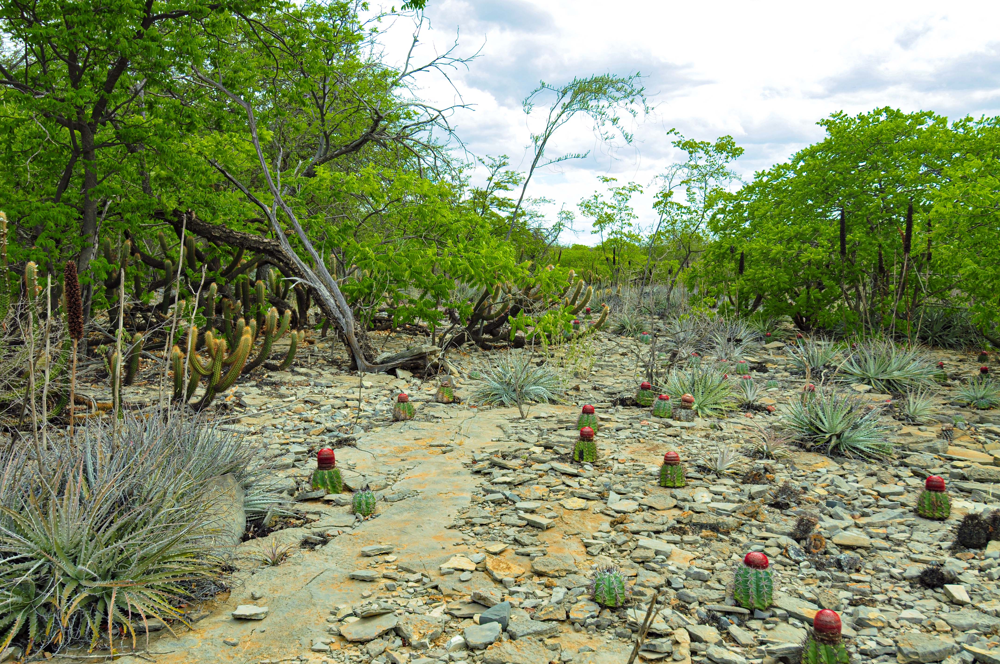

  

  

    
    
    
    
    
    
    
    

    
    
    
    
    
    
    
    

    
    
    
    
    
    
    
    
  

  

    Caatinga
    Cerrado
    Protocols
  

  

    Standardized protocols are the backbone of long-term monitoring: they keep data comparable across sites, teams and years.
  

  

    Rede C2 works with permanent plots in dry ecosystems and connects with broader monitoring initiatives. This page gathers core protocol references that can support plot establishment, remeasurement, field standardization, data harmonization and cross-network comparability.
  

  

    The DRYFLOR field manual is especially relevant for Rede C2 because it offers a standardized workflow for permanent plots in seasonally dry tropical forests, including plot layout, tagging, remeasurement and woody stem monitoring.
  

  <h2 class="section-title">Core protocol references</h2>

  

    

      
Rede C2

      
Network base

      

        Space for Rede C2’s own protocols, field sheets and coding standards for plot installation, recensus, disturbance records, traits and soils.
      

      

        <a class="pill" href="plot-establishment.html">Plot protocol</a>
        <a class="pill pill-green" href="datasheets.html">Datasheets</a>
        <a class="pill pill-amber" href="field-codes.html">Field codes</a>
      

    

    

      
DRYFLOR field manual

      
Dry forest permanent plots

      

        A key manual for establishing and remeasuring permanent plots in seasonally dry tropical forests. It is especially useful for woody stems, tagging rules and long-term comparability.
      

      

        <a class="pill" href="https://www.dryflor.info/files/Protocol_v1.2_English.pdf" target="_blank" rel="noopener">English</a>
        <a class="pill pill-green" href="https://doi.org/10.5521/forestplots.net/2020_4c" target="_blank" rel="noopener">Português DOI</a>
        <a class="pill" href="https://www.dryflor.info/files/Protocol_v1.2_Spanish.pdf" target="_blank" rel="noopener">Español</a>
      

    

    

      
ForestPlots.net

      
Field resources and manuals

      

        ForestPlots.net provides field resources, publications and practical material that support tropical plot monitoring and interoperability across networks.
      

      

        <a class="pill" href="https://forestplots.net/en/using-forestplots/in-the-field" target="_blank" rel="noopener">In the field</a>
        <a class="pill pill-green" href="https://forestplots.net/en/publications" target="_blank" rel="noopener">Publications</a>
      

    

    

      
SECO

      
Dry tropics compatibility

      

        SECO connects dry tropics monitoring initiatives and provides protocol pages and modules that align with DryFlor, ForestPlots and related networks.
      

      

        <a class="pill" href="https://blogs.ed.ac.uk/seco-project/science/protocols/" target="_blank" rel="noopener">Protocols page</a>
        <a class="pill pill-green" href="https://bitbucket.org/miombo/seosaw/raw/master/doc/manuals/soil_manual/versions/SECO_soil_protocol_latest_pt.pdf" target="_blank" rel="noopener">Soils PT</a>
        <a class="pill" href="https://blogs.ed.ac.uk/seco-project/wp-content/uploads/sites/2074/2022/08/seco_leaf_traits.pdf" target="_blank" rel="noopener">Leaf traits</a>
      

    

    

      
SEOSAW

      
Linked woodland modules

      

        SEOSAW offers interoperable protocols and datasheets for woodland monitoring, useful as a methodological reference for compatible modules and workflow design.
      

      

        <a class="pill" href="https://seosaw.github.io/manuals.html" target="_blank" rel="noopener">Protocols</a>
      

    

    

      
Recommended citation anchor

      
DRYFLOR Portuguese manual

      

        This DOI can be used as a stable citation anchor when referring to the Portuguese DRYFLOR field manual in Rede C2 methods and protocol references.
      

      

        <a class="pill pill-amber" href="https://doi.org/10.5521/forestplots.net/2020_4c" target="_blank" rel="noopener">DOI</a>
      

    

  

  <h2 class="section-title">Suggested Rede C2 sections</h2>

  

    

      
Plot establishment and remeasurement

      

        Plot geometry, subplot layout, coordinates, tagging, recensus intervals and replacement rules.
      

      

        <a class="pill" href="plot-establishment.html">Open</a>
      

    

    

      
Woody stems census

      

        Diameter standards, multiple stems, damage codes, recruits, mortality and field note structure.
      

      

        <a class="pill" href="woody-census.html">Open</a>
      

    

    

      
Herb layer and regeneration

      

        Modules for herbs, seedlings and regeneration tracking compatible with dry-forest and savanna workflows.
      

      

        <a class="pill" href="herb-layer.html">Open</a>
      

    

    

      
Soils, traits and disturbance

      

        Optional compatible modules inspired by partner networks to maximize interoperability and ecological interpretation.
      

      

        <a class="pill" href="soils.html">Soils</a>
        <a class="pill pill-green" href="traits.html">Traits</a>
        <a class="pill pill-amber" href="disturbance.html">Disturbance</a>
      

    

  

